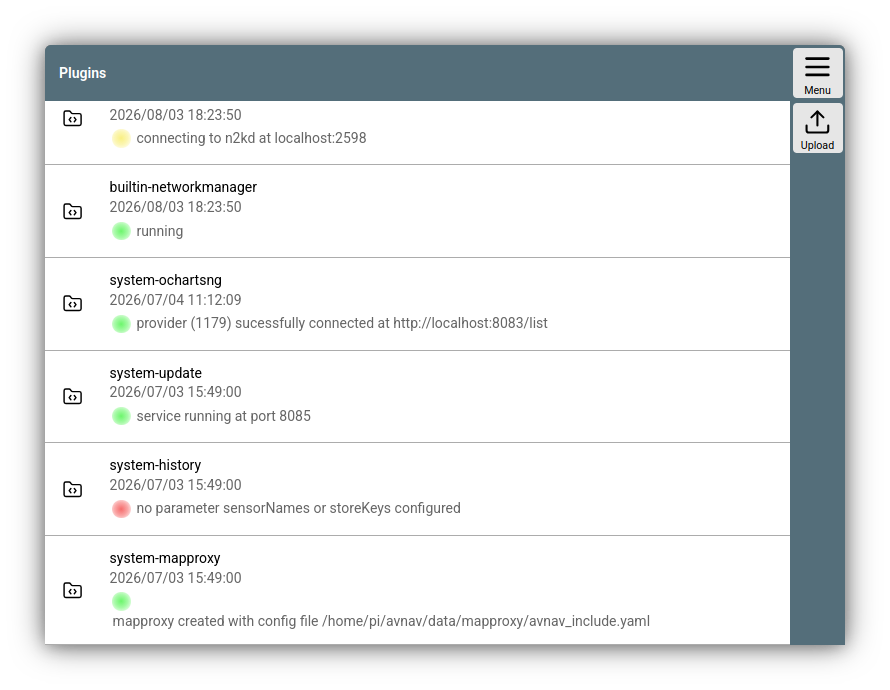
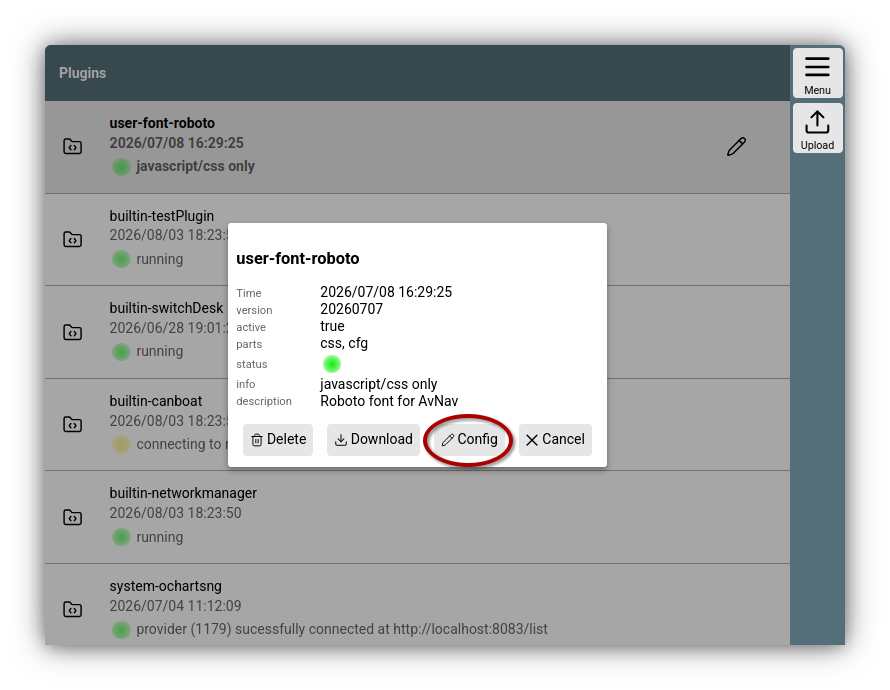
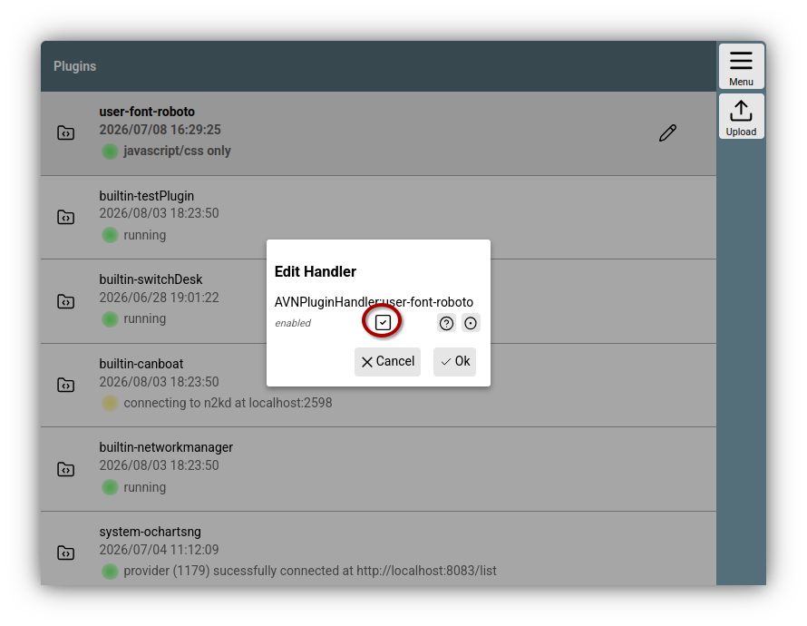
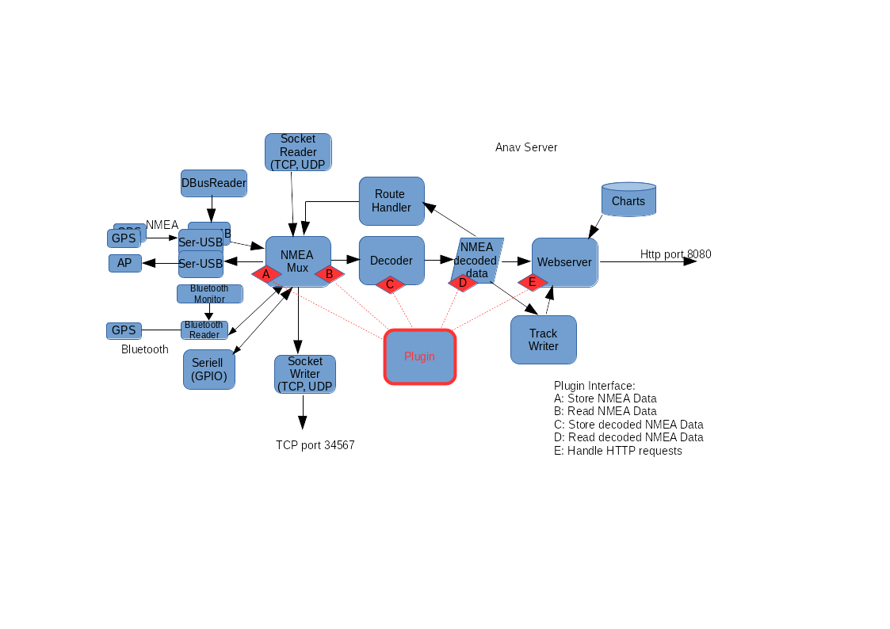

---
  tags:
    - Plugins
    - Erweiterungen
    - JavaScript
    - Python
---

# Plugins {: #overview }

Plugins können den Funktionsumfang von AvNav erweitern. Typische Plugin-Anwendungen sind:

  * Das Hinzufügen neuer Anzeigen (Widgets)
  * Das Hinzufügen von Layouts
  * Neue Icons, Farben, Button-Text
  * Fonts
  * Neue Kartenformate
  * Neue Kartenquellen oder Karten
  * History-Funktionen
  * ...

AvNav bietet dazu verschiedene Schnittstellen, über die Plugins Erweiterungen einbringen können:

  * Erweiterungen für den Anzeige-Teil mit JavaScript Code oder CSS
  * User Apps (d.h. eigene GUIs, die in AvNav eingebettet werden)
  * Erweiterungen für den Server Teil (_nur Windows/Linux/Raspberry_ - nicht Android).

## Installation von Plugins {: #installation }

Es gibt zwei Wege für die Installation von Plugins:

  1. Als Debian Pakete

     Unter Linux (auch Raspberry) können Plugins als debian Pakete ausgeliefert werden.Diese installieren ihren Inhalt nach /usr/lib/avnav/plugins/*name-des-plugins*.

     In AvNav sind diese Plugins mit dem Prefix `system-` sichtbar.

  2. Als Zip Datei
     
     Dazu muss die ZIP Datei genau einen Ordner mit dem Namen des Plugins enhalten. Code und Daten müssen sich unterhalb dieses Ordner befinden. Eine solche Zip-Datei kann dann über 

     {{MM("MMpluginpage")}}=>{{BT("Upload")}}

     in AvNav installiert werden. Sie werden im AvNav Datenverzeichnis unter `plugins` installiert.

     Diese Plugins sind mit dem Prefix `user-` sichtbar.

Daneben gibt es noch einige Plugins, die direkt mit AvNav ausgeliefert werden. Diese sind mit dem Prefix `builtin-` sichtbar.

Auf der Plugin Seite {{MM("MMpluginpage")}} erhält man eine liste der momentan installierten Plugins.


///caption
Plugin Liste
///

Durch Klick auf einen Eintrag erhält man einen Dialog.


///caption
Plugin Dialog
///

Falls es sich um ein `user-` Plugin wie im Beispiel handlet, kann man es hier löschen oder als Zip Datei herunterladen. Falls das Plugin eine [UserApp](TODO: #userapp) mitbringt, kann man diese direkt über den Button {{DB("DBUserApp")}} von hier erreichen.

Über {{DB("DBConfig")}} kann man Parameter für das Plugin ändern - oder es ggf. deaktivieren.
{: #pluginconfig }


///caption
Plugin Config
///


## Liste von Plugins 

Eine Liste von Plugins findet sich [hier](plugin-list.md).

## Erstellen von Plugins

Plugins sind Zip Dateien oder Debian Pakete, die verschiedene Bestandteile enthalten. Jedes Plugin wird in ein Verzeichnis auf dem AvNav Server installiert. Die genaue Struktur der Zip Datei oder des Debian Paketes ist unter [Bauen](#build) beschrieben.

Die hier beschriebenen Bestandteil müssen sich im Basisverzeichnis des Plugins befinden.

### JavaScript Code {: #jscode }

_Alle Plattformen_

Plugin Java Script code muss sich in der Datei plugin.mjs befinden. Diese Datei wird als [JavaScript Modul](https://developer.mozilla.org/de/docs/Web/JavaScript/Guide/Modules) geladen. Der Code wird nur geladen, wenn das Plugin nicht [deaktiviert](#pluginconfig) wurde. Nach einem Update wird der Code automatisch neu geladen. Für den Plugin-JavaScript-Code stehen die gleichen Interfaces und Funktionen wie für [Nutzer-JavaScript-Code](userjs.md) zur Verfügung.

??? "Kompatibilität zu früheren Versionen - plugin.js"
    In früheren Versionen befand sich der JavaScript code in einer Datei plugin**.js**. Das war eine einfache JavaScript Datei (kein Modul).
    Auch die aktuelle Version unterstützt nach wie vor eine plugin.js Datei.
    Da diese Date in der aktuellen Version ebenfalls über ein JavaScript Modul geladen wird und Module strikteren JavaScript code verlangen, kann es zu Fehlern beim Laden der Datei kommen. Dann muss man seinen Code ggf. [anpassen](https://developer.mozilla.org/de/docs/Web/JavaScript/Guide/Modules#andere_unterschiede_zwischen_modulen_und_klassischen_skripten).
    Falls beide Dateien vorhanden sind, wird nur die plugin.mjs geladen.
    
    Falls man sein Modul noch kompatibel zu älteren AvNav Versionen (vor 202607xx) bauen möchte, kann man den gesamten Code in die plugin.mjs Datei legen und zusätzlich eine Datei plugin.js mit dem folgenden Inhalt dazufügen:
    
    ``` js
    import("./plugin.mjs").then((module)=>module.default(avnav.api));
    ```
    Dann muss man aber im Code stets testen, ob etwaige neue API Funktionen bereits vorhanden sind.


### CSS {: #plugincss }

_Alle Plattformen_

Mit einer Datei `plugin.css` kann ein Plugin CSS mitbringen um das Aussehen von AvNav anzupassen. Es stehen die gleichen Funktionen wie für [Nutzer-CSS](usercss.md) zur verfügung.

Als Plugin-Entwickler sollte man bedenken, das der CSS code sofort wirksam wird, wenn das Plugin geladen wurde. Falls man z.B. nur zusätzliche Anzeigen (Widgets) einbringen möchte, sollte man den CSS Code so gestalten, das er nur diese eigenen Widgets beeinflusst - nicht die anderen Darstellungen in AvNav.

### plugin.json {: #pluginjson }

_Alle Plattformen_

Ein Plugin kann eine Datei `plugin.json` mitbringen. Diese Muss ein JSON Objekt mit verschiedenen Keys enthalten.
``` json
{
    "version":"20260810",
    "description":"Test plugin from the documentation".
}
```
Die Keys und ihre Bedeutung (alle sind optional).

| Key | Typ | Beschreibung |
| --- | --- | ---|
| version | String | Die plugin Version |
| description | String | Eine kurze Beschreibung des Plugins (max. 80 Zeichen) |
| charts | Array | Eine Beschreibung von [Karten](charts.md#pluginjsondef), die das Plugin mitbringt.|
| userApps | Array | Eine Liste von UserApps - siehe [unten](#pluginusermaps) |
| layouts | Array | Eine Liste von Objekten, die Layouts beschreiben. Jedes Element muss die Keys `name`für den Namen des Layouts und `file` für einen relativen Dateinamen zum Layout-JSON-File enthalten |


#### UserApps {: #pluginuserapps }

Die Einträge für den Parameter userApps müssen folgende Werte enthalten:

| Name | Typ | Beschreibung |
| --- | --- | --- |
| url | String, erforderlich | die URL für die User App. Kann eine relativer Pfad zu einer HTML Datei im Plugin sein |
| icon | String | relativer Pfad zu einer Icon Datei. Alternativ per CSS.|
| shortText  | String | Kurztext für den Button. Alternativ per CSS |
| longText | String | Langtext für den Button. Alternativ per CSS |
| title | String | Titel für die Anzeige. Wenn nicht gesetzt, wird keine Titelzeile angezeigt |
| page | String | die [AvNav Seite](https://github.com/wellenvogel/avnav/blob/master/viewer/util/pageids.ts), auf der dier Button für die UserApp angezeigt werden soll. |
| name | String | Der Name für den Button. Wird auch für die CSS Klasse genutzt. Der finale CSS Name wird gebildet aus prefix-pluginname-name. Also für ein Zip-Plugin mit dem Namen "test" und dem Namen "ui": `user-test-ui`.|


### Python Code {: #pluginpython }

_Nur Windows/Linux/Raspberry. Nicht auf Android._

Um Serverfunktionen zu erweitern können Plugins auch Python code enthalten. Der Startpunkt ist eine Datei `plugin.py`.

AvNav bietet für den Python-Code eine Reihe von Interfaces.



Die Zeichnung gibt einen groben Überblick über die interne Struktur des
AvNav Servers und die Punkte, an denen ein Plugin Daten auslesen oder
einspeisen kann.

| Punkt | Funktion | Beispiel |
| --- | --- | --- |
| A | Einspeisen von NMEA Daten in die interne Liste. Diese stehen dann an allen Ausgängen zur Verfügung.  Hinweis: Solche Daten stehen zunächst nicht für die WebApp zur Verfügung, solange es keinen Dekoder für diesen Datensatz gibt. | Auslesen eines Sensors und Erzeugen des passenden NMEA0183 Datensatzes. |
| B | Auslesen von empfangenen NMEA Daten. Hier können (ggf. mit einem Filter) alle in AvNav durchlaufenden NMEA Daten gelesen werden. | In Zusammenspiel mit Punkt "C" Dekodieren von NMEA Datensätzen |
| C | Einspeisen von Daten in den internen Speicher von AvNav. Die Daten im internen Speicher sind in einer Baumstruktur abgelegt. Jedes Element ist durch einen Schlüssel der Form "a.b.c...." adressiert. Beispiel: "gps.lat".  Alle Schlüsselwerte, die mit "gps." starten, werden automatisch an die WebApp übertragen und sind dann dort unter "nav.gps...." verfügbar. (siehe [Layout Editor](TODO layouts.md) und [nutzerspezifisches Java Script](userjs.md)).  Schlüsselwerte müssen vorher durch das Plugin angemeldet werden, es ist nicht möglich, bereits im System genutzte Schlüssel zu überschreiben. Ausnahme: Der Nutzer konfiguriert für das Plugin den Wert "allowKeyOverride" auf true. | Einspeisen eines von einem Sensor gelesenen Wertes - z.B. gps.temperature.outside oder von dekodierten NMEA Daten. |
| D | Auslesen von Daten aus dem internen Speicher. | Berechnung neuer Daten und Einspeisung unter "C" - oder Weiterreichen an eine externe Verbindung. |
| E | Bearbeiten von HTTP Requests | Die Java script Anteile können einen HTTP request senden, der im python code bearbeitet werden kann.  Anworten typischerweise in Json |

Ein Beispiel für eine plugin.py findet sich auf [GitHub](https://github.com/wellenvogel/avnav/blob/master/server/plugins/testPlugin/plugin.py).

Damit das Plugin von AvNav erkannt wird, müssen folgende Voraussetzungen
eingehalten werden:

1. In plugin.py muss mindestens eine Klasse vorhanden sein (der Name
   sollte Plugin sein)
2. Die Klasse muss eine statische Methode (@classmethod) mit dem Namen
   pluginInfo haben, die ein dictionary zurückgibt.  
   ``` python
   # description (mandatory)
   # data: list of keys to be stored (optional)
   # path - the key - see AVNApi.addData, all pathes starting with "gps." will be sent to the GUI
   # description
   @classmethod
   def pluginInfo(cls):  
    return {
        'description': 'a test plugins',
        'data': [
            {
                'path': 'gps.test',
                'description': 'output of testdecoder',
            }
            ]   
    }
   ```
3. Der Konstruktor der plugin Klasse muss einen Parameter erwarten.  
   Beim Aufruf wird hier eine Instanz des [API](https://github.com/wellenvogel/avnav/blob/master/server/avnav_api.py)
   übergeben, über das die Kommunikation mit AvNav erfolgt.
4. Die Klasse muss eine run Methode (ohne Parameter) besitzen.  
   Diese wird in einem eigenen Thread aufgerufen, nachdem die
   Initialisierung abgeschlossen ist.  
   Typischerweise wird diese Methode eine Endlosschleife enthalten, um die
   Plugin-Funktion zu realisieren.

#### Plugin API

Am [API](https://github.com/wellenvogel/avnav/blob/master/server/avnav_api.py)
stehen die folgenden Funktionen zur Verfügung

| Funktion | Beschreibung |
| --- | --- |
| log,debug,error | Logging Funktionen. Es werden Zeilen in die AvNav log Datei geschrieben. Man sollte für log und error vermeiden, solche Einträge in grosser Zahl zu schreiben, da sonst im Log potentiell wichtige Informationen verloren gehen (also z.B. nicht jede Sekunde ein Fehlereintrag...) |
| getConfigValue | lies einen config Wert aus der [avnav_server.xml](configfile.md#plugins). |
| fetchFromQueue | Interface B: lies Daten aus der internen NMEA Liste. Ein Beispiel ist im API code vorhanden. Der filter Parameter funktioniert wie in der [avnav_server.xml](configfile.md#filter). |
| addNMEA | Interface A: schreibe einen NMEA Datensatz in die interne Liste. Man kann AvNav die Prüfsummenberechnung überlassen und man kann auch eine Dekodierung in AvNav verhindern. Der Parameter source ist ein Wert, der in [blackList parametern](configfile.md#blackList) genutzt werden kann. |
| addData | Interface C: schreibe einen Wert in den internen Speicher. Es können nur Werte geschrieben werden, deren Schlüssel in der Rückgabe der pluginInfo Methode vorhanden waren. |
| getSingleValue | Interface D: lies einen Datenwert aus dem internen Speicher. Zur Zusammenfassung mehrerer solcher Lesevorgänge existiert die Funktion getDataByPrefix |
| setStatus | Hier sollte der aktuelle Zustand des Plugins gesetzt werden. Das ist der Wert, der auf der Plugin-Seite {{MM("MMpluginspage")}} angezeigt wird. |
| registerUserApp | Ein Plugin kann eine [User App](../base/userapps.md) registrieren. Dafür nötig ist eine URL und eine Icon Datei. Die Icon Datei sollte mit im Plugin Verzeichnis liegen. In der URL kann $HOST verwendet werden, das wird dann durch die korrekte IP Adresse des AvNav Servers ersetzt. |
| registerLayout | Falls das Plugin z.B. eigene Widgets mitbringt, ist es u.U. hilfreich ein vorbereitetes Layout mitzuliefern, das der Nutzer dann auswählen kann. Das Layout dazu nach der Erstellung mit dem [Layout Editor](../base/layout.md) herunterladen und im Plugin Verzeichnis speichern. |
| registerSettingsFile  (since 20220225) | Registrierung einer eigenen Einstellungsdatei (die vorher von der Settingsseite aus exportiert werden kann).  Der Dateiname (zweiter Parameter) ist relativ zum Plugin-Verzeichnis. Der Name (erster Parameter) wird dem Nutzer angezeigt.  IN dieser Datei kamm man  $prefix$ im Layout-Namen nutzen, wenn das Layout im gleichen Plugin regsitriert wird.` "layoutName": "$prefix$.main" ` |
| getDataDir | Das Verzeichnis, in dem AvNav Daten ablegt |
| registerChartProvider | Falls das Plugin [Karten](charts.md#insertingpython) bereitstellt, wird hier ein callback registriert, der eine Liste der Karten zurückgibt. |
| registerRequestHandler | Falls das Plugin HTTP requests bearbeiten soll (Interface E) muss hier ein callback registriert werden, der den Request behandelt. Die url für den Aufruf ist:  <pluginBase>/api  Dabei ist pluginBase der unter getBaseUrl zurückgegebene Wert.  Die [java script Anteile](#jscode) können die API url mit der Funktion `api.getBaseUrl()+"/api"` bilden. Im einfachsten Fall kann die aufgerufene callback-Funktion ein dictionary zurückgeben, dieses wird als Json zurück gesendet. |
| getBaseUrl | gib die Basis URL für das Plugin zurück |
| registerUsbHandler  (ab 20201227) | registriert einen Callback für ein USB Gerät. Mit dieser Registrierung wird AvNav mitgeteilt, dass es das USB Gerät nicht beachten soll. Der Callback wird mit dem Device-Pfad für das Gerät aufgerufen, wenn das Gerät erkannt wurde.  Die USB-Id kann am einfachsten durch Beobachten der Status-Seite beim Einstecken des Gerätes ermittelt werden. Siehe auch [AVNUsbSerialReader](configfile.md#AVNUsbSerialReader). Damit kann ein Plugin selbst einfach das Handling für ein spezielles Gerät übernehmen, Ein Beispiel findet sich auf [GitHub](https://github.com/wellenvogel/avnav-seatalk-remote-plugin/blob/master/plugin.py). |
| getAvNavVersion  (ab 20210115) | Aktuelle AvNav Version (int) |
| saveConfigValues  (ab 20210322) | Speichere config Werte für das Plugin in avnav\_server.xml. Der Parameter muss ein dictionary mit den Werten sein. Das Plugin muss sicherstellen, dass es später mit diesen Werten wieder starten kann. |
| registerEditableParameters  (ab 20210322) | Registriert eine Liste mit config Werten, die zur Laufzeit geändert werden können. Der erste Parameter ist eine Liste von dictionaries mit den Parameter Beschreibungen, der zweite ein callback, der bei Änderungen mit den geänderten Werten aufgerufen wird (wird typischerweise saveConfigValues rufen).  Die Syntax für die Parameter-Liste ist im [Source Code](https://github.com/wellenvogel/avnav/blob/master/server/avnav_api.py) beschrieben. |
| registerRestart  (ab 20210322) | Registriere einen Stop Callback. Damit kann das Plugin disabled (deaktiviert) werden. |
| unregisterUserApp  (ab 20210322) | Deregistriere eine User App. |
| deregisterUsbHandler  (ab 20210322) | Deregistriere eine usb device id (siehe registerUsbHandler) |
| shouldStopMainThread  (ab 20210322) | Kann in der Hauptschleife genutzt werden, um zu prüfen, ob das Plugin gestoppt werden soll. In jedem anderen Thread wird immer True zurück gegeben. |
| sendRemoteCommand  (ab 20230426) | Sende ein Fernsteuerungskommando, siehe den [Source Code](https://github.com/wellenvogel/avnav/blob/3a291c2e08bfaa13b12246f9a456a4a896533d52/server/avnav_api.py#L344) für Details. |
| registerSettingsFile  (ab 20230426) | Mache eine Datei mit gespeicherten Einstellungen bekannt. Diese kann vom Nutzer dann geladen werden. |
| registerCommand  (ab 20230426) | Registriere ein Kommando, das von AvNav ausgeführt werden kann. Dieses kann z.B. dafür genutzt werden ein bereits vorhandenes Kommando zu ersetzen. Auch neue Kommandos sind möglich. Siehe den [Source Code](https://github.com/wellenvogel/avnav/blob/3a291c2e08bfaa13b12246f9a456a4a896533d52/server/avnav_api.py#L364) oder die [AVNCommandHandler Konfiguration](configfile.md#AVNCommandHandler) für Details. |
| registerConverter  (since 20240520) | Registriere einen Karten-Konverter  Für ein Beispiel siehe das [ochartsng plugin](https://github.com/wellenvogel/ochartsng/blob/f10d8aa8b10ce89320b939a91e14ceaa822054a0/avnav-plugin/plugin.py#L407) |
| deregisterConverter  (since 20240520) | Deregistriere einen Karten-Konverter |
| clearAlarms (20250723) | Lösche alle Alarme |
| startAlarm (202607xx) | Erzeuge einen Alarm |
| clearAlarm (202607xx) | Lösche einen Alarm |
| getRunningAlarms (202607xx) | Liste aller aktiven Alarme |

## Bauen {: #build }

### Zip Datei
Um ein Plugin für die Nutzung durch Andere bereitzustellen, kann man es vorzugsweise als Zip-Datei bereitstellen. Plugins als Zip-Datei können auf allen von AvNav unterstützten Plattformen verwendet werden. Falls sie auch für Android vorgesehen sind, sollten sie keinen Python Code enthalten, da dieser dort nicht verwendet wird.
Eine solche Zip-Datei für ein Beispiel-Plugin mit dem Namen `doctest` hat z.B. den folgenden Inhalt
```
d doctest
f doctest/plugin.json
f doctest/plugin.mjs
f doctest/plugin.css
d doctest/images
f doctest/images/icon.svg
```
Nach der [Installation](#installation) wird das Plugin als `user-doctest`in AvNav sichtbar.

Diese Zip Datei kann mit einem beliebigen Zip-Tool erzeugt werden. Wichtig ist, das bei neuen Versionen der Name des Verzeichnisses in der Zip-Datei immer gleich bleibt. Der Name der Zip-Datei spielt für AvNav keine Rolle - er sollte jedoch das Plugin und eine Version enthalten, um die Verwendung durch den Nutzer zu vereinfachen.

Vorzugsweise sollte man das Plugin auf einer Git-Plattform (z.B. [GitHub](https://github.com/) ) pflegen und die Zip-Datei in jeder Release bereitstellen. Man sollte dabei in der [plugin.json](#pluginjson) den Wert für `version` jeweils setzen.

Falls man unter Linux das Plugin bauen möchte, gibt es [hier](https://github.com/wellenvogel/avnav-font-noto/blob/master/build.sh) ein Beispiel für ein einfaches Build-Script zum Erzeugen der Zip-Datei.

### Debian Pakete

Falls ein Plugin nur unter Linux/Raspberry laufen soll, kann man es auch als Debian Paket ausliefern. Man kann dazu direkt die [Debian Package Tools](https://www.debian.org/doc/manuals/maint-guide/build.en.html) nutzen. Falls das zu kompliziert ist, kann man [NFPM](https://nfpm.goreleaser.com/docs/) oder das [Gradle OsPackage Plugin](https://github.com/nebula-plugins/gradle-ospackage-plugin) nutzen. Für NFPM gibt es einen Docker-Container, so das das Erstellen des Build sehr einfach ist. Ein Beispiel findet man im [avnav-update-plugin](https://github.com/wellenvogel/avnav-update-plugin/blob/master/buildPkg.sh).

Das Paket muss so gebaut werden, das alle zum Plugin gehörenden Daten unter `/usr/lib/avnav/plugins/plugin-name` entpackt werden.

Plugins, die als Debian-Pakete ausgeliefert werden, erfordern nach der Installation einen Neustart von AvNav.


## Aktivieren und Verbergen von System Plugins

Um plugins "unsichtbar" zu machen, die mit debian Paketen installiert
wurden, gibt es ein Script /usr/lib/avnav/plugin.sh.  
Als root kann man dieses Script aufrufen um die Sichtbarkeit von system
plugins zu steuern und default Parameter zu setzen.  
Ein Aufruf ohne Parameter bringt eine Hilfe mit den Aufruf-Optionen.

## Spezialfunktionen für den Raspberry Pi {: #scripts}

Plugins die als debian Pakete für den Raspberry Pi erzeugt werden (system
plugins) können ein Shell Script "plugin-startup.sh" bereitstellen.  
Dieses Script ermöglich es plugins, Systemparameter zu konfigurieren.  
Es wird immer während des Bootprozesses des Systems aufgerufen.  
Ob und mit welchen Parametern ein solches Script aufgerufen wird, hängt
von einem Parameter in der Datei /boot/firmware/avnav.conf ab (siehe [ImageVorbereitung](../installation/raspberry.md#preparation)). Der Parametername ist:  
`AVNAV_<PLUGIN>`
Dabei ist <PLUGIN> der Pluginname (d.h. der Name seines
Verzeichnisses) übersetzt in Großbuchstaben (und ohne alle Zeichen ausser
0-9 und a-z).  
Wenn dieser Parameter auf "yes" gesetzt ist, wird das Pluginscript
gerufen.

Es gibt 3 Aufruf-Varianten:

### plugin-startup.sh enable

Dieser Aufruf findet beim ersten Boot mit dem Parameter in der avnav.conf
auf "yes" statt.  
Das Plugin sollte jetzt alle notwendigen Änderungen am System vornehmen
(wenn möglich so, das sie auch später wieder rückgängig gemacht werden
können).  
Typischerwe betrifft das Anpassungen /boot/firmware/config.txt oder anderen
Konfigurationsdateien.  
Das Script sollte 1 zurückgeben, wenn ein Reboot nötig ist, sonst 0 oder
< 0 bei Fehlern.

Es gibt einige [Helper
Funktionen](https://github.com/wellenvogel/avnav/blob/master/raspberry/setup-helper.sh) die im Script genutzt werden können. Diese Helper
Funktionen bindet man mit
``` sh
. "$AVNAV_SETUP_HELPER"
```
in das Script ein.  
Die Umgebungsvariable `AVNAV_SETUP_HELPER` ist gesetzt, wenn das Script
aufgerufen wird.  
Ein Beispiel findet man im [obp-plotterv3-plugin](https://github.com/wellenvogel/avnav-obp-plotterv3-plugin/blob/master/plugin-startup.sh).

### plugin-startup.sh disable

Dieser Aufruf wird ausgeführt, wenn der Parameter in der avnav.conf von
yes auf einen anderen Wert geändert oder entfernt wird. Das Script sollte
die am System gemachten Änderungen - soweit möglich - wieder zurücknehmen.  
Anmerkung: Da das Handling im Normalfall nur dazu vorgesehen ist, einmalig
bei der ersten Nutzung eines Images stattzufinden, ist es kein grosses
Problem, wenn Änderungen nicht zurückgenommen werden.

### plugin.startup.sh [keine Parameter]

Dieser Aufruf erfolgt bei jedem boot. In diesem Falls sollten keine
Einstellungen im System geändert werden - es könnte sonst sehr
überraschend für den Nutzer sein, wenn bei einem beliebigen Startvorgang
plötzlich Systemeinstellungen geändert werden. Es können aber
beispielsweise notwendige Initialisierungen von Hardware vorgenommen
werden.


