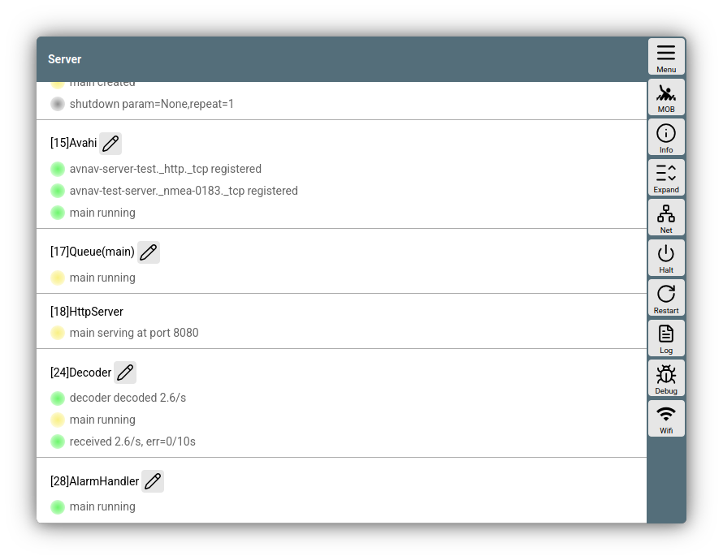
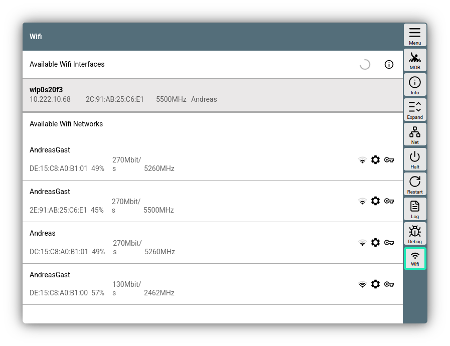
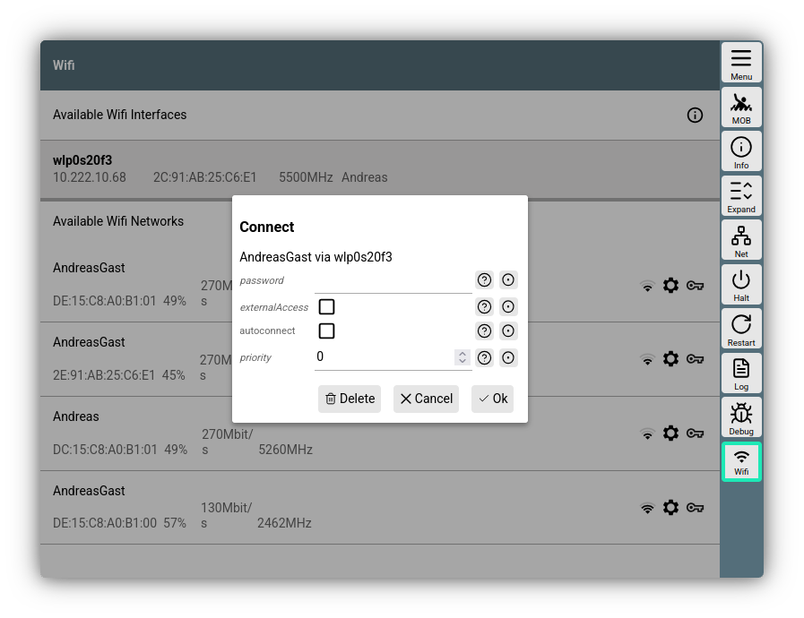

---
  tags:
    - Server
    - Konfiguration
    - Netzwerk
    - Wifi
---
# Serverseite

Über 

{{MM("MMserverpage")}} 

erreicht man eine Seite, die die Einstellungen des AvNav Servers zusammenfasst.

///caption
Server Seite
///

## Einstellungen
Auf der linken Seite können die verschiedenen Bestandteile des Servers konfiguriert werden. Für eine Beschreibung siehe die [Konfiguration](configfile.md).

Im Normalfall werden nur die Server-Bestandteile hier angezeigt, die auf keiner der anderen Seiten konfiguriert werden (z.B. Verbindungen, Routen,...). Über den Button
{{BT("StatusAll")}} kann die Ansicht auf alle Funktionseinheiten erweitert werden.

## Buttons

Über die Buttons auf der rechten Seite können eine Reihe von Funktionen bzw. Unterseiten erreicht werden. Dabei hängen die angezeigten Funktionen vom System ab (Android oder Windows, Linux/Rasperry).

| Button | System | Funktion |
| --- | --- | --- |
| {{BT("MainInfo")}} | alle | Anzeige einer Seite mit Versions- und Lizenzinformationen |
| {{BT("StatusAll")}} | alle | Zeige alle Serverfunktionen |
| {{BT("StatusAddresses")}}| alle | Zeige eine Seite mit den IP Adressen des Servers |
| {{BT("StatusAndroid")}}| Android | Öffne die [Android Einstellungen](../installation/android.md#Settings) |
| {{BT("AndroidBrowser")}} | Android | Öffne die AvNav Oberfläche im System-Browser (nur falls der [WebServer](configfile.md#webserver) aktiviert wurde) |
| {{BT("StatusShutdown")}} | Linux/Raspberry | Stoppt den AvNav Server Computer. Nur falls im [CommandHandler](configfile.md#avncommandhandler) ein `shutdown` Kommando eingerichtet ist - wie z.B. auf den [AvNav Images](../installation/raspberry.md#images). |
| {{BT("StatusRestart")}} | Linux/Raspberry/Windows | Restarte den AvNav Server (nicht den Computer - nur die AvNav Server Software). |
| {{BT("StatusLog")}} | Linux/Raspberry/Windows | Zeige die Logdatei des AvNav Servers an (mit der Möglichkeit zum Herunterladen). |
| {{BT("StatusDebug")}}| Linux/Raspberry/Windows | Zeige einen Dialog an, um für eine gewisse Zeit den AvNav Debug Modus einzuschalten. Damit wird die Log-Ausgabe wesentlich ausführlicher und es können ggf. Fehler gefunden werden. |
| {{BT("StatusAdd")}} | alle | Richte eine neue Verbindung ein. Nur in der erweiterten Ansicht. |
| {.inline-image}| [AvNav Images](../installation/raspberry.md#images) (trixie) | Zeige eine [Konfigurationsseite](#wifi) für Wifi Client Verbindungen |

## Wifi Client Konfiguration {: #wifi }

Diese Funktion steht nur auf den [AvNav Images](../installation/raspberry.md#images) zur Verfügung (oder wenn das Paket `avnav-raspi-network` installiert wurde).

Um AvNav mit einem anderen Wifi Netzwerk zu  verbinden, muss der AvNav Server einen zusätzlichen Netzwerk-Adapter (USB Wifi Stick) erhalten (neben dem Adapter, der für den AvNav Access Point genutzt wird). Siehe dazu auch die [Hinweise zum Verbinden](connecting-pi.md).

In der [Image Konfiguration](../installation/raspberry.md#preparation) kann man entscheiden, welcher der verfügbaren Netzwerk-Adapter für den Access Point genutzt werden. Alle anderen stehen hier zur Verfügung.

Die Konfiguration der Netzwerke erfolgt über den [Network Manager](https://networkmanager.dev/).

Über einen Klick auf {.inline-image} erhält man einen Dialog zur Konfiguration.

///caption
Wifi Konfiguration
///

Im oberen Bereich werden alle zur Verfügung stehenden Netzwerk-Interfaces angezeigt, die nicht für den internen Access Point genutzt werden. Falls bereits eine Verbindung zu einem Wifi Netzwerk besteht wird diese mit der IP Adresse unter dem Interface angezeigt.

Mit einem Klick darauf kann man einen Dialog zum Trennen der Verbindung aufrufen.

Mit einem Klick auf eines der angezeigten Netzwerke erhält man einen Verbindungs-Dialog.

///caption
Wifi Verbindungsdialog
///

Man kann hier die Parameter für die Verbindung setzen (oder ändern).

| Name | Beschreibung |
| --- | --- |
| password | Das Wifi Passwort für das Netzwerk |
| externalAccess | Falls gesetzt, kann über das Netzwerk auch auf den AvNav Server zugegriffen werden. **Achtung: Das ist ein Sicherheitsrisko. Der AvNav Server ist nocht gegen einen unbefugten Zugriff geschützt. Also nur in vertrauenswürdigen Netzwerken aktivieren - nicht in einem öffentlichen Wifi-Netzwerk** |
| autoConnect | Falls eingeschaltet, wird versucht, mit diesem Netzwerk automatisch wieder zu verbinden |
| priority | Falls mehrere Netzwerke mit autoconnect konfiguriert sind, werden sie nach der hier angegebenen Prirität genutzt. 0 ist die niedrigste Priorität.|

Mit {{DB("DBOk")}} wird der Dialog geschlossen und die Verbindung wird aufgebaut. Der Fortschritt wird angezeigt.

Über den (i) Button oben rechts kann man sich die gesamte Netzwerk-Konfiguration des Servers anzeigen lassen.

