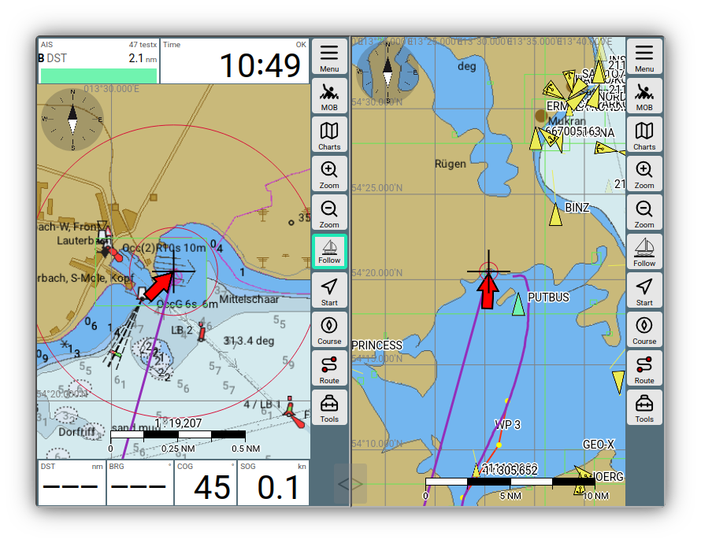
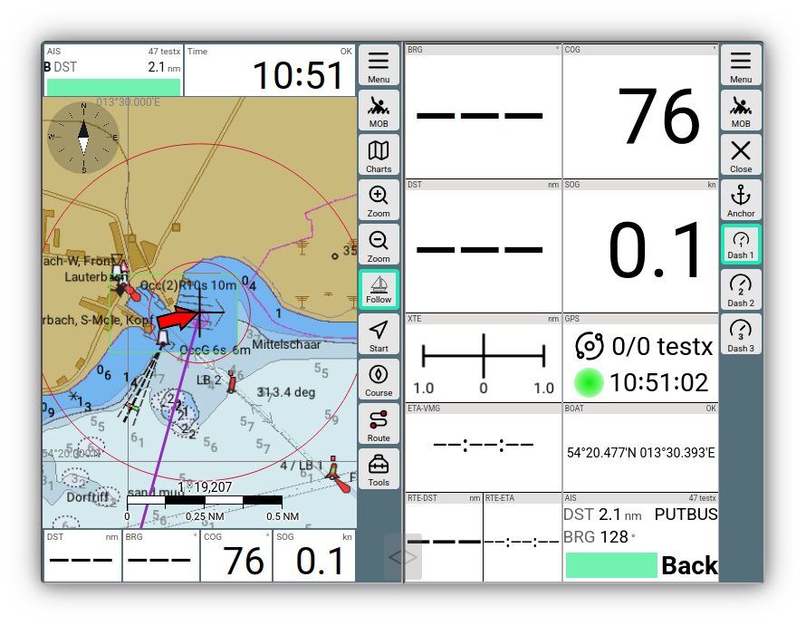

---
  tags:
    - Split Mode
    - Tabs
---

# 2-Fenster-Modus (Split Mode)

## Benutzung 

Mit

{{MM("MM:actions")}}->{{BT("Split",True)}}

kann man eine 2-Fenster-Ansicht einschalten.

///caption
2 Fenster Karte
///

///caption
2 Fenster Dashboard
///

Die beiden Fenster arbeiten weitgehend unabhängig voneinander. So kann man sich je nach Wunsch verschiedene Darstellungen nebeneinander legen. Im Beispiel entweder 2 mal eine Kartenansicht (mit unterschiedlichen Zoom-Stufen - oder auch mit verschiedenen Karten) - oder auch eine Kartenansciht und ein Dashboard.

Über 

{{MM("MM:actions")}}->{{BT("Split",True)}}

kann der 2-Fenster-Modus auch wieder verlassen werden.

Über den halb transparenten Schieber kann die Aufteilung des Bildschirmes zwischen den Fenstern verändert werden.

## Besonderheiten

### Alarme

im 2-Fenster-Modus werden Alarme nur im rechten Fenster angezeigt.

### Einstellungen (Display Settings)

Die meisten [Einstellungen](../base/settings.md) gelten im 2-Fenster-Modus für beide Fenster gemeinsam und werden dort auch sofort wirksam. Einige Einstellungen kann man jedoch pro Fenster separat vornehmen. Diese werden auf den Einstellungsseiten mit einem `*` gekennzeichnet. 
Das sind insbesondere die Einstellungen für die [Fernsteuerung](remotecontrol.md).

Das Laden und Speichern von Einstellungen erfolgt auch pro Fenster separat.

Falls man weitere Einstellungen pro Fenster separat vornehmen möchte, kann man die Datei `splitkeys.json` in den Nutzer-Dateien anpassen. Man erreicht diese über

{{MM("MMaddonconfigpage")}}

und kann sie dort editieren. Nach Änderungen muss man AvNav im Browser neu laden.

Mit der Einstellung

{{MM("MMsettingspage")}}->General->"start with last split mode"

kann man erreichen, das AvNav wieder im Split Mode startet, wenn er zuletzt aktiv war. Das ist insbesondere für Android hilfreich.

### Layouts

Layouts kann man für jedes Fenster separat wählen. Damit kann man (wie im Beispiel) die Kartendarstellung unterschiedlich gestalten. Ein im Split-Mode geladenes Layout bleibt nicht aktiv, wenn der Split-Mode wieder verlassen wird.
