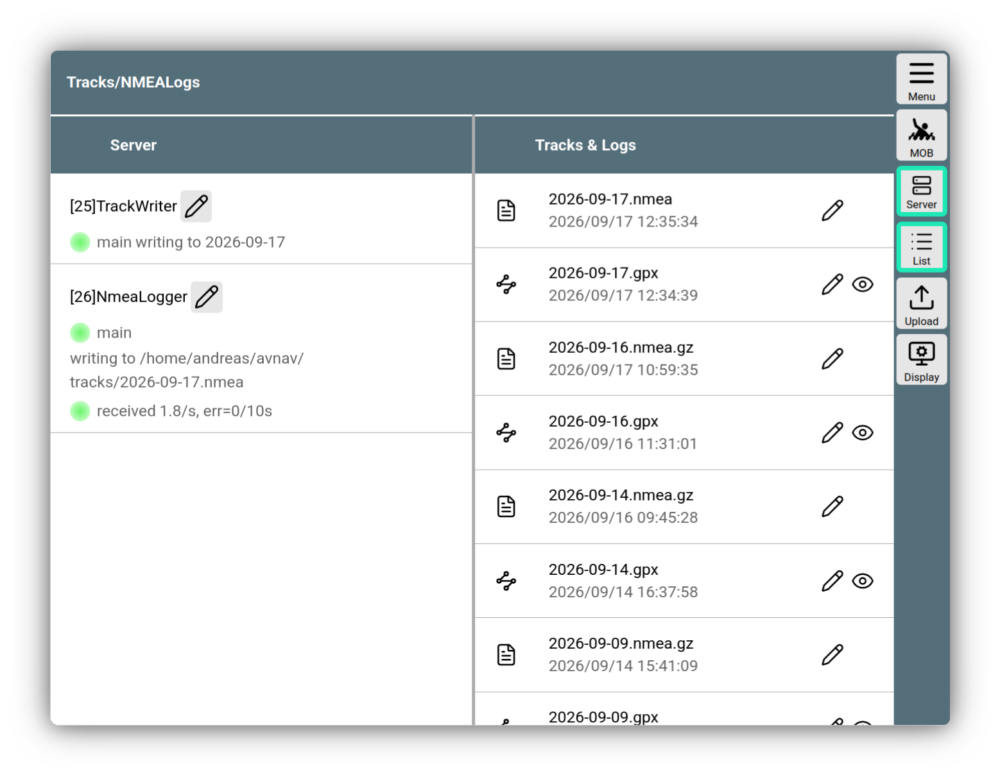

---
  tags:
    - Track
    - Server
    - NMEA
    - NMEALogger
---

# Tracks und NMEA Logs

Wenn AvNav läuft, zeichnet es beständig den aktuellen Track auf. Dabei werden die aktuelle Position, Zeit, Geschwindigkeit und Kurs festgehalten.

Die Aufzeichnung erfolgt dabei auf dem Server und is unabhängig davon, ob gerade ein Anzeigegerät verbunden ist. Unter [Android](../installation/android.md) erfolgt die aufzeichnung auch, wenn AvNav im Hintegrund-Modus läuft.

Die Track-Daten werden in [GPX](https://de.wikipedia.org/wiki/GPS_Exchange_Format) Track Dateien geschrieben. Pro Tag wird jeweils eine neue Datei angelegt.

In der Linux/Windows Version werden die Daten zunächst in einem internen Format geschrieben, das dann periodisch in eine GPX Datei gewandelt wird.

Unter Android wird in periodischen Abständen die aktuelle GPX Datei direkt geschrieben.
Um die Datenmenge zu begrenzen, wird ein neuer Track-Punt nur geschrieben, wenn entweder ein Mindestabstand oder eine Mindestzeit zum vorigen Trackpunkt erreicht wurde - siehe [Einstellungen](#settings).

Auf der [Navigationsseite](../base/navpage.md) wird der aktuelle Track (mit einer einstellbaren Länge) angezeigt. Zusätzlich können weitere Tracks als [Overlays](../base/overlays.md) auf der Karte angezeigt werden.

Ausserdem ermöglicht AvNav auch die Aufzeichnung der empfangenen NMEA Daten - siehe [NMEA Logs](#logs).

## Verwaltung und Konfiguration

Die Verwaltung von Tracks und NMEA Logs erreicht man über

{{MM("MMtrackspage")}}

///caption
Tracks und NMEA Logs
///

Auf der linken Seite kann man die serverseitigen Parameter für den Track-Writer und den NMEA-Logger einstellen.

In der Konfigurationsbeschreibung sind die einzustellenden Parameter erklärt.
{: #settings}

| System | Einheit |
| --- | ---|
| Windows/Linux | [Track Writer](configfile.md#avntrackwriter)|
| Android | [Track Writer](configfile.md#track) |
| Windows/Linux | [NNMEA Logger](configfile.md#avnnmealogger) |
| Android | [NMEA Logger](configfile.md#logger)|

Über {{BT("ShowSettings")}} können die Parameter für die Track-Darstellung auf der Navigationsseite eingestellt werden.
Das beinhaltet:

| Name | Beschreibung |
| --- | --- |
| `Point Dist(s)`| Abstand von 2 Trackpunkten. Dieser muss natürlich mindestens so groß sein, wie der entsprechende Parameter in den Server-Einstellungen - dichter liegende Punkte werden nicht aufgezeichnet. |
| `Length(h)` | Länge des anzuzeigenden Tracks in Stunden |

## NMEA Logs {: #logs}

AvNav schreibt mit seinem NMEA Logger alle NMEA Daten, die es im Multiplexer sieht in Log-Dateien. Auch hier wird per default jeweils eine Log-Datei pro Tag geschrieben. Um die Datenmenge begrenzen zu können, lassen sich in den [Einstellungen](#settings) Filter festlegen. Um Probleme analysieren zu können, wird man im Normalfall die Filter entfernen, damit alle NMEA-Daten aufgezeichnet werden. Für den Normalbetrieb sollte man allerdings Filter nutzen, da sonst die Datenmengen wirklich groß werden können. 

Die Log-Dateien können ebenfalls 

{{MM("MMtrackspage")}}

im gleichen Verzeichnis wie die Track-Dateien gefunden werden. Dort können sie auch angesehen, heruntergeladen oder gelöscht werden.

Log-Dateien vergangener Tage werden mittels gzip komprimiert, beim Anschauen werden sie automatisch ausgepackt.
