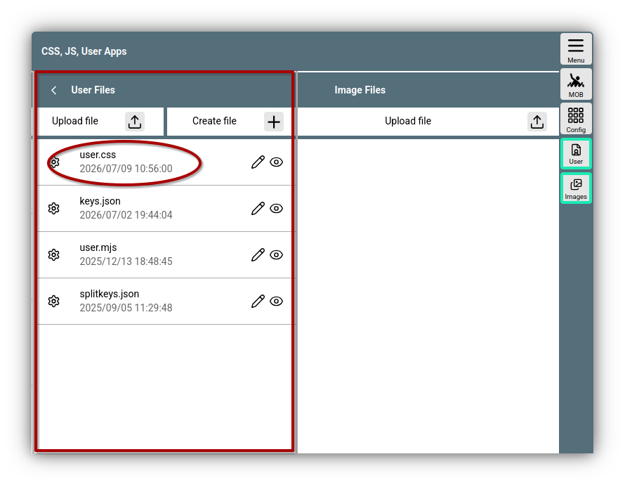
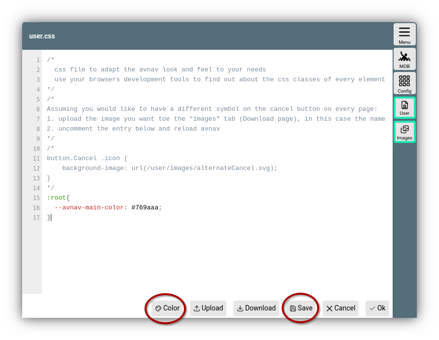
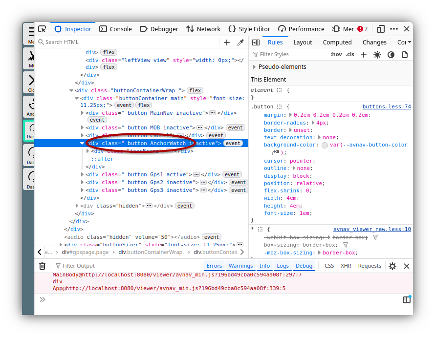

---
  tags:
    - CSS
---
Anpassung mit css
=================

Da AvNav eine Web-Anwendung ist,
kann man das Aussehen weitgehend mit CSS anpassen.

Die dafür vorgesehene Datei user.css befindet sich im Verzeichnis für Nutzerdateien (BASEDIR/user/viewer Verzeichnis - BASEDIR ist /home/pi/avnav/data auf den [raspberry-pi Images](../installation/raspberry.md#images), sonst $HOME/avnav).

Man kann über 

{{MM("MMaddonconfigpage")}}->{{BT("AddonConfigUser")}}

die Dateien im Nutzerverzeichnis auflisten, bearbeiten, neue Dateien erzeugen oder hochladen. Dort findet sich auch die Datei user.css.



///caption
Nutzerdateien - user.css
///

Durch Klick auf die Datei und Auswahl von "Edit" kann die Datei
bearbeitet werden. Bei der Installation wurde ein Template eingebracht,
das ein Beispiel enthält.

## Editor


///caption
user.css - Editor
///

Der Editor beherrscht ein Syntax-Highlighting und kann so helfen eine korrekte CSS Syntax zu erzeugen.
Sobald man den {{DB("DBSave")}} Button klickt, wird die Datei gespeichert und die Änderungen werden auf allen angeschlossenen Bildschirmen sichtbar. Damit kann man recht einfach mit zwei Browsers-Fenstern oder Tabs arbeiten - in einem Fenster hat man den Editor geöffnet, im anderen Fenster die Ansicht, die man ändern möchte.

## Variablen

Für eine ganze Reihe von Anzeige-Eigenschaften gibt es in AvNav [benutzerdefinierte Eigenschaften](https://developer.mozilla.org/de/docs/Web/CSS/Guides/Cascading_variables/Using_custom_properties).

Die von AvNav gesetzten Werte findet man in [properties.less](https://github.com/wellenvogel/avnav/blob/master/viewer/style/properties.less).

Im Beispielbild wurde die Farbe für die Seitentitel (--avnav-main-color) auf einen etwas helleren Wert gesetzt.

## Farb-Editor

Um Farben einfach bearbeiten zu können, kann man einen Farbwert im CSS markieren, dann über {{DB("DBColor")}} den Farb-Editor aufrufen und beim Schließen wird der neue Farbwert eingefügt.

## Eigenschaften finden

Am schnellsten geht das Anpassen von Eigenschaften unter Nutzung der Entwicklertools der Browser (oft durch F11 oder eine ähnliche Kombination aufrufbar - oder über das Menü).
Dazu sollte man einen Desktop/Laptop Browser nutzen - mit Browsern auf Mobilgeräten ist das meist nicht möglich.


///caption
Entwicklertools
///

Im Beispiel eingekreist ist der Button für die Ankerwache auf den Dashboard-Seiten. Das in den Entwicklertools angeklickte Element wird meist in der Webseite hervorgehoben.

## Buttons und Icons
Um Buttons oder Icons anzupassen muss man den Namen des Buttons/ Icons ermitteln.
Mit der Anzeige im Bild haben wir herausgefunden, das der button den Namen [AnchorWatch](../../buttons/buttons.md#AnchorWatch) hat - wir können noch einmal mit der Buttonliste vergleichen.
Wenn wir nun das Bild durch ein anderes Bild ersetzen wollen, müssen wir zunächst das Bild als .svg Datei hochladen. Das erfolgt im {{BT("AddonConfigImages")}} Bereich der Seite auf der wir auch die user.css bearbeiten.

Wir können nun den folgenden CSS code einfügen (das bild heisst alt-anchor.svg):
```
.button.AnchorWatch .icon{
    background-image: url(/user/images/alt-anchor.svg);    
}
```

Falls wir für den legacy Icon Satz ein anderes Icon möchten können wir zusätzlich einfügen:

```
.icon-legacy .button.AnchorWatch .icon{
    background-image: url(/user/images/alt-anchor-legacy.svg);    
}
```
Für einen veränderten Text können wir folgendes CSS nutzen:
```
.button.AnchorWatch:after{
    content: 'ANCHR'
}
```
Falls einer der langen Texte geändert werden soll, erfordert das
```
.button.AnchorWatch.longText:after{
    content: 'ANCHR'
}
```

## Spezifität

Falls es mehrere CSS regeln für das gleiche Element gibt (meist der Fall), wird die [Spezifität](https://developer.mozilla.org/de/docs/Web/CSS/Guides/Cascade/Specificity) berücksichtigt. Falls es mehrere Regeln mit gleicher Spezifität gibt, gewinnt die zuletzt gelesene Regel. AvNav sorgt dafür, das die Regeln aus user.css immer zuletzt gelesen werden - und damit bei gleicher Spezifität andere Regeln überschreiben.
Wenn aber die Spezifität geringer ist, funktioniert es nicht. Im obigen Beispiel würde daher `AnchorWatch .icon{` nicht funktionieren, da in AvNav schon `button.AnchorWatch .icon{` genutzt wird.

## Andere CSS Quellen

Die hier beschriebenen Funktionen gelten auch für andere Quellen von CSS - also Layouts und Plugins.
  