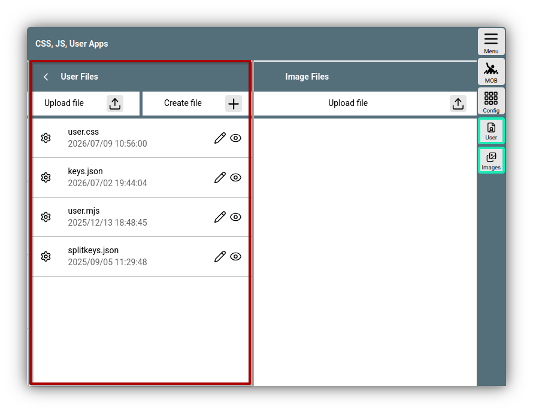
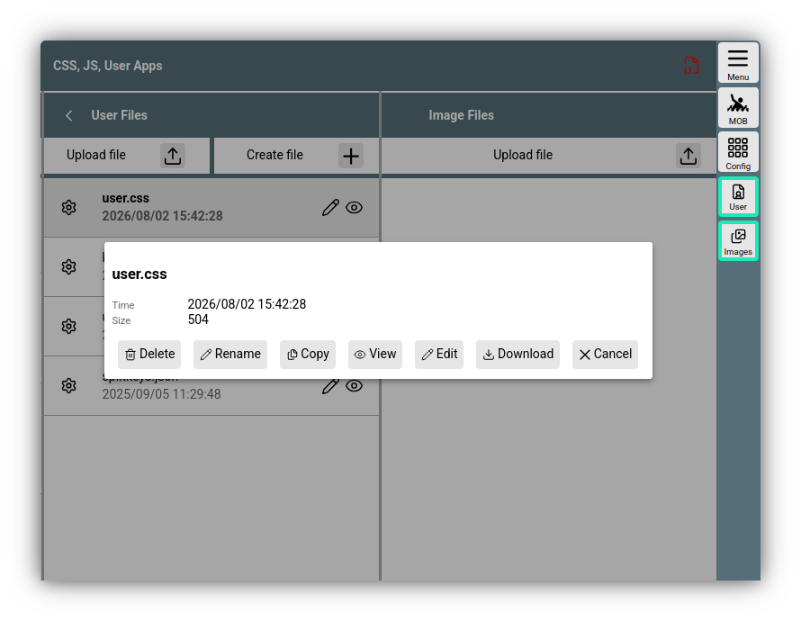
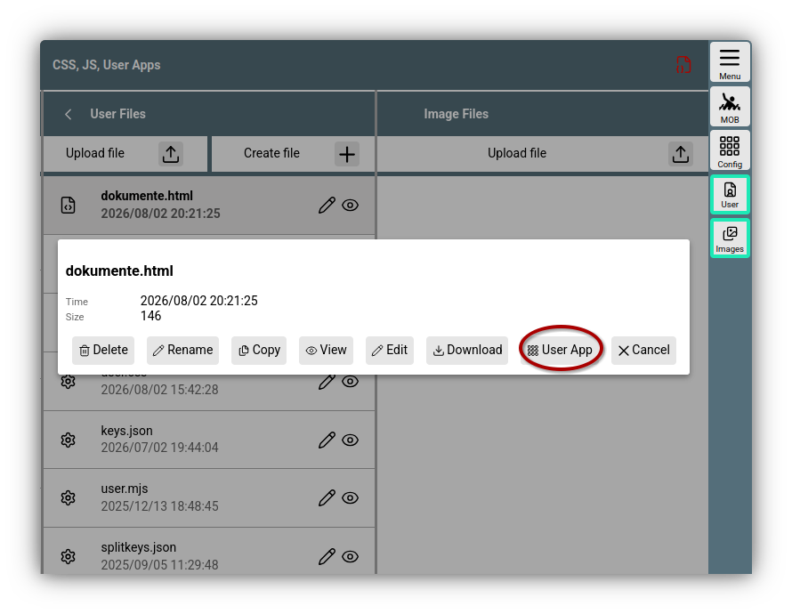
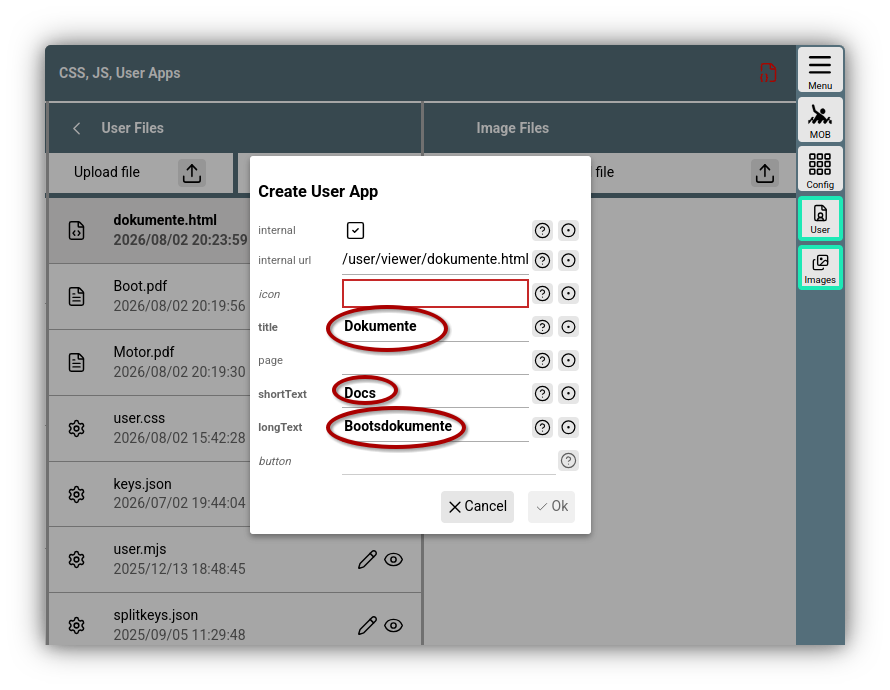

---
  tags:
   - Nutzerdateien
   - Erweiterungen
   - User Apps
---

# Nutzer Dateien (user files)

AvNav kann Dateien für den Nutzer speichern, die man direkt über die Web-Oberfläche erzeugen, 
hochladen, bearbeiten ansehen und herunterladen kann.
Diese Dateien werden im AvNav Datenverzeichnis unter .../user/viewer gespeichert. Das Datenverzeichnis ist normalerweise im Home-Verzeichnis des Nutzers unter avnav zu finden. Auf den [Raspberry Pi Images](../installation//raspberry.md#images) liegt es unter /home/pi/avnav/data und unter Android wird es in den Android Einstellungen festgelegt.

## Anzeige und Aktionen

Man erreicht die Ansicht der Nutzerdateien unter

{{MM("MMaddonconfigpage")}}->{{BT("AddonConfigUser")}}


///caption
Nutzerdateien
///

Initial sind dort nur einige Template Dateien vorhanden:
{ #specialfiles }

* [user.css](usercss.md): Anpassung per CSS
* [user.mjs](userjs.md): Nutzer JavaScript
* [keys.json](keyboard.md): Tastatur Kürzel
* [splitkeys.json](TODO: split mode): Anpassungen für den Split Mode

Nach Klick auf eine Datei erhält man einen Dialog mit einigen Zusatz-Informationen und mit verschiedenen möglichen Aktionen.


///caption
Aktionen
///

### Aktionen { #fileactions }

Die möglichen Aktionen hängen vom Dateityp ab. Für bekannte Type wie im Beispiel gibt es:

| Button | Funktion |
| --- | --- |
| {{DB("DBDelete")}} | Lösche die Datei |
| {{DB("DBRename")}} | Vergib einen neuen Namen für die Datei. *Hinweis*: Wenn man z.B. die user.css umbenennt, wirkt sie nicht mehr und der AvNav Server wird beim nächsten Start wieder eine template Datei dafür anlegen.|
| {{DB("DBCopy")}} | Kopiere die Datei auf dem Server. |
| {{DB("DBView")}} | Zeige die Datei an. Für die meisten unterstützten Dateien ist das eine einfache Textanzeige |
| {{DB("Edit")}} | Bearbeite die Datei in einem eingebauten Editor. Im Normalfall ist das ein Texteditor mit einer Syntax-Einfärbung für bekannte Dateien. |
| {{DB("DBDownload")}} | Lade die Datei vom Server herunter und speichere sie auf dem Gerät, das gerade zur Anzeige genutzt wird. | 

## Anlegen und Hochladen

Falls man eine neue Datei anlegen möchte benutzt man dazu den Button {{SB('CreateFile')}} oberhalb der Dateiliste. Nach der Namensauswahl wird für editierbare Dateien ein Editor-Dialog geöffnet, für einige Dateitypen wird ein Template-Text eingefügt. Mit {{DB("DBSave")}} bzw. {{DB("DBOk")}} wird die Datei gespeichert (nur aktiv wenn die Datei geändert wurde).

Zum Hochladen vom Gerät, auf dem der Browser läuft, den Button {{SB("Upload")}} oberhalb der Dateiliste benutzen. Falls eine Datei gleichen Namens bereits existiert, kann ein neuer Name für die Datei vergeben werden.

## Bilder { #images }

Auch Bilddateien können als Nutzerdateien gespeichert werden. Um etwas mehr Übersicht zu erhalten, können diese auch unter {{BT("AddonConfigImages")}} gespeichert werden. Die Funktionen sind die gleichen.

## Nutzung der Dateien

Neben den oben beschriebenen [speziellen Dateien](#specialfiles) können im Nutzerverzeichnis beliebige Dateien abgelegt werden.

Besonders nützlich können HTML Dateien sein. Da alle Dateien aus diesem Verzeichnis über die URL
```
  http://nn.nn.nn.nn:8080/user/viewer/xxx
```
von einem Webbrowser aus erreichbar sind, kann man damit sehr einfach zusätzliche Seiten schaffen, die innerhalb von AvNav (oder auch ausserhalb) angezeigt werden können. Dazu steht (auf der gleichen Seite unter {{BT("AddonConfigAddons")}}) die Möglichkeit zur Verfügung, die Dateien als sogenannte "[User App](../base/userapps.md)" bzw. AddOn einzurichten.

## Beispiel für eine HTML Datei { #userappexample }

Mit einer HTML Datei und weiteren hochgeladenen Dateien kann man sich z.B. eine ganz einfache Dokumentenliste bauen, die man dann per Klick in AvNav nutzen kann.
Angenommen man hat 2 Dokumente `Boot.pdf` und `Motor.pdf`. Diese werden als Nutzerdateien wie beschrieben über {{SB("Upload")}} hochgeladen.
Mit {{SB('CreateFile')}} erzeugt man eine HTML Datei `dokumente.html` mit dem folgenden Inhalt:
```
<html>
<head>
 <style>
   li{
    line-height: 1.5em;
   }
 </style>
</head>
<body>
<h1>Dokumente</h1>
<ul>
  <li><a href="Boot.pdf">Boot</li>
  <li><a href="Motor.pdf">Motor</li>
</ul>
</body>
</html>
```

Nun braucht man  nur noch eine Bild-Datei für den Button, mit dem diese Liste künftig aufgerufen werden soll. Icons findet man z.B. bei [material icons](https://fonts.google.com/icons?icon.query=document&icon.size=24).
Als Beispiel nimmt man ein icon und speichert es unter dem Namen "dokumente.svg" bei den [Images](#images).

Wenn man auf die Datei "dokumente.html" klickt, erhält man einen erweiterten Dialog.


///caption
Beispiel HTML Datei
///

Mit Klick auf {{DB("DBUserApp")}} öffnet sich ein Dialog, mit dem die  Dokumente als [User App](../base/userapps.md) eingerichtet werden.


///caption
Einrichtung UserApp
///
Man füllt die markierten Werte aus, unter icon wählt man das hochgeladene Icon aus und speichert mit {{DB("DBOk")}}.

Im Tab {{BT("AddonConfigAddons")}} wird man nun die neue UserApp sehen können mit dem gewählten Icon. Mit einem Klick auf das Icon kann man sich die neu gebaute Seite anzeigen lassen.

Man findet den neu angelegten Button später unter 
{{MM("MMaddonpage")}}
