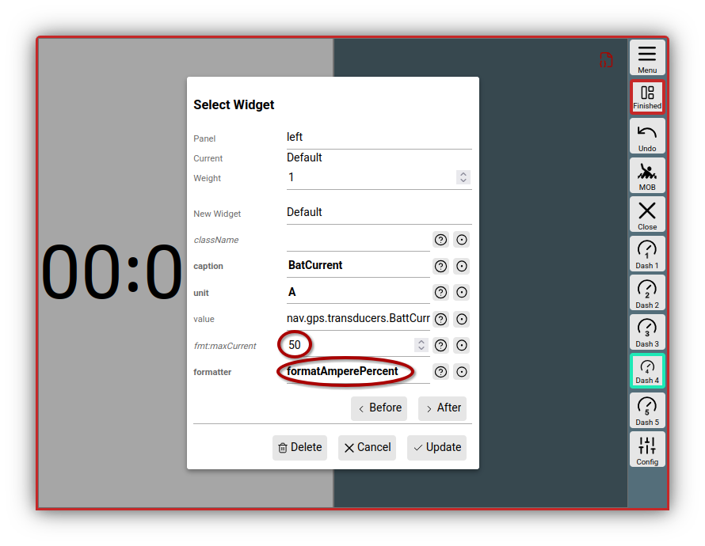
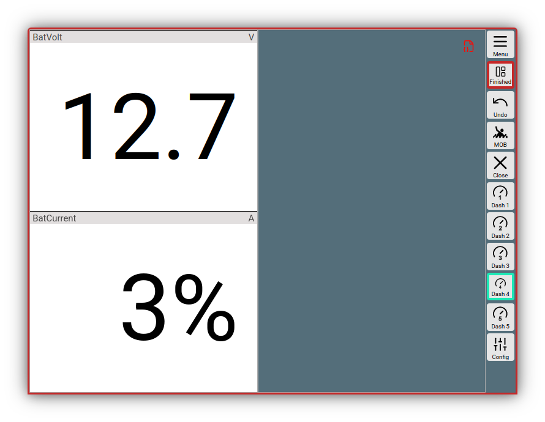

---
  tags:
    - Erweiterungen
    - JavaScript
---

# Nutzer JavaScript Code

Um eine einfache Möglichkeit zu bieten, AvNav an seine Bedürfnisse
anzupassen, kann man mit ein wenig Java Script Code AvNav relativ einfach
erweitern.
Die möglichen Erweiterungen werden in den folgenden Kapiteln beschrieben.
Prinzipiell kann man beliebigen Java Script Code ausführen - muss dabei aber natürlich zusehen, die Funktionen von AvNav nicht zu stören.

Der Java Script Code liegt bei den [Nutzerdateien](userfiles.md) in der Datei **user.mjs**. Diese Datei ist ein [JavaScript Modul](https://developer.mozilla.org/de/docs/Web/JavaScript/Guide/Modules) und wird von AvNav am Ende seines Start-Prozesses geladen. 
Der Hauptinhalt dieser Datei ist eine exportierte Funktion, die von AvNav nach dem Laden aufgerufen wird. Der Parameter "api" ist das [AvNav interface](https://github.com/wellenvogel/avnav/blob/master/viewer/api/api.interface.ts) das durch den Code genutzt werden kann.

Ein minimaler Inhalt der Datei könnte so aussehen:

```
export default (api)=>{
    api.log("Hello world);
}
```

??? "Kompatibilität zu früheren Versionen - user.js"
    In früheren Versionen befand sich der JavaScript code in einer Datei user**.js**. Das war eine einfache JavaScript Datei (kein Modul). 
    Das neue Handling mit user.mjs hat einige Vorteile:
    
    * automatisches Neu-Laden bei Änderungen
    * erweitertes API (mehr Funktione möglich)
    * es können weitere Module geladen werden.
    
    Falls AvNav durch ein Update installiert wurde und eine alte user.js Datei existiert, wird diese weiter genutzt. Das zur Verfügung stehende API entält allerdings nur einen Teil der Funktionen des aktuellen APIs.
    Da diese Date in der aktuellen Version ebenfalls über ein JavaScript Modul geladen wird und Module strikteren JavaScript code verlangen, kann es zu Fehlern beim Laden der Datei kommen. Dann muss man seinen Code ggf. [anpassen](https://developer.mozilla.org/de/docs/Web/JavaScript/Guide/Modules#andere_unterschiede_zwischen_modulen_und_klassischen_skripten).
    Die alte Beschreibung für die user.js ist [hier](userjs-legacy.md) verfügbar.
    Falls sowohl eine user.mjs (neu) als auch eine user.js (alt) vorhanden sind, wird nur die user.mjs geladen.

## Bearbeiten der Datei user.mjs
Über 

{{MM("addonconfigpage")}}->{{BT("AddonConfigUser")}}

erreicht man die Liste der Dateien im Nutzerverzeichnis. Nach Klick auf die Datei "user.mjs" und {{DB("Edit")}} wird ein Editorfenster geöffnet, in dem man den Code bearbeiten kann.
Um effektiv arbeiten zu können, empfiehlt es sich, mit zwei Browser-Fenstern oder Tabs zu arbeiten - in einem Fenster hat man den Editor geöffnet, im anderen Fenster AvNav noch einmal in dem Bereich, den man testen möchte. Beim Specihern der Datei im Editor-Fenster wird diese im Hintergrund sofort in allen offenen AvNav Fenstern neu geladen und wird direkt wirksam.

Der Editor hat eine Syntax-Anzeige für JavaScript, so das man bereits bis zu einem gewissen Grad die Korrektheit des Codes sehen kann.

Für die Arbeit an der Datei sollte man in dem Browser-Fenster, in dem man testet, die Entwickler-Werzeuge öffnen und dort die "Konsole" sichtbar haben. Fehler im JavaScript Code werden dort ausgegeben.

Wenn man die Bearbeitung beendet hat, sollte man AvNav in allen Browser-Fenstern neu laden (einen Hinweis darauf bekommt man durch das rote Icon {{ICON("JSChanged")}} in der Titelzeile - ein Klick darauf führt zu einem Dialog für das Neu-Laden).

In der vom System angelegten user.mjs Datei befinden sich bereits einige Beispiele, die man durch Entfernen von Kommentarzeichen aktivieren kann.

Das aktuelle Template kann man auch [auf
github](https://github.com/wellenvogel/avnav/blob/release-{{config.extra.version}}/viewer/static/user.mjs) finden.

## Formatierer (Formatter) { #formatter }

Ein typischer Anwendungsfall für einen neuen Formatter ist die Anzeige eines bisher nicht bekannten Wertes über das Default Widget (siehe [Layouts](layout.md)).
Das könnte z.B. ein über einen XDR Datensatz empfangener Lade- oder Entladestrom sein. In den Daten ist der Wert in A, wir möchten den Wert aber gerne in % eines Maximalwertes anzeigen lassen.
Dazu können wir den folgenden Code nutzen:
```
const formatAmperePercent=(val)=>{
  const max=50; //fix max
  if (isNaN(val)) return "-----";
  const percent=Number(val)*100/50;
  return percent.toFixed(0)+"%";
}
api.registerFormatter("formatAmperePercent",formatAmperePercent);
```
Wenn wir diesen Formatter so in unsere user.mjs geschrieben haben, können wir nun sofort im Layout Editor den Formatter nutzen indem wir das Default Widget auswählen, unter "value" den anzuzeigenden Wert selektieren und unter "formatter" unseren formatAmperePercent auswählen.

Natürlich ist das so noch nicht besonders komfortabel - der Maximalwert ist fest kodiert. Wenn wir wollen, das der Maximalwert im Layout Editor auswählbar wird, müssen wir noch Parameter für unseren Formatter festlegen.
Wir definieren nur einen Parameter "maxCurrent".

```
const formatAmperePercent=(val,max)=>{
  if (isNaN(val)) return "-----";
  if (! max) max=50;
  const percent=Number(val)*100/max;
  return percent.toFixed(0)+"%";
}
formatAmperePercent.parameters=[
  {
    name: "maxCurrent",
    type: "FLOAT",
    default: 50,
    description: "Maximal current for computing the percentage"
  }
]
api.registerFormatter("formatAmperePercent",formatAmperePercent);
```
Die Parameter für einen Formnatter werden ähnlich beschrieben, wie [Widget Parameter](#widgetparameters), nur das sie als Array angegeben werden mit einem zusätzlichen Feld "name"
Wenn wir num im Layout-Editor unseren Formatter nutzen, sieht das Bild so aus:


///caption
Formatter mit Paremetern
///

Und das Resultat dann (unteres Widget):


///caption
Formatter Resultat
///
Falls wir nun mit der einfachen JavaScript "toFixed" Funktion nicht zufrieden sind, können wir natürlich stattdessen auch einen der bereits [vorhandenen Formatter](layout.md#formatter) verwenden.
Wir möchten hier 3 Stellen haben und verwenden formatDecimal.
```
...
return api.formatter.formatDecimal(percent,3)+"%";
```

## Anzeigen (Widgets) {: #widgets}

Man kann die folgenden Arten von Anzeigen hinzufügen:

* Widgets mit eigenem [Formatter](#formatter) (und ggf. festen Werten) basierend auf
  dem Default Widget (Beispiel 1 - [user.mjs](https://github.com/wellenvogel/avnav/blob/master/viewer/static/user.mjs):  rpmWidget)
* Anpassung/Erweiterung der Grafik Widgets mit [canvas
  gauges](https://canvas-gauges.com/) (Beispiel 2 - [user.mjs](https://github.com/wellenvogel/avnav/blob/master/viewer/static/user.mjs)
  rpmGauge)  
  Hiermit ist es auch möglich, Parameter zugänglich zu machen, die in den
  bisher vorhandenen Widgets nicht enthalten sind
* Widgets mit eigenem HTML code (Beispiel 3 - [user.mjs](https://github.com/wellenvogel/avnav/blob/master/viewer/static/user.mjs):
  userSpecialRpm)
* Widgets mit Grafik in einem Canvas Element (Beispiel im [TestPlugin:](https://github.com/wellenvogel/avnav/blob/master/server/plugins/testPlugin/plugin.js)
  testPlugin\_courseWidget)
* Widgets mit eigenem HTML, die mit dem Server Teil eines Plugins
  interagieren ([TestPlugin](https://github.com/wellenvogel/avnav/blob/master/server/plugins/testPlugin/plugin.js):
  testPlugin\_serverWidget)
* Widgets, die Grafiken auf der Karte darstellen (type: map) - ab
  20220819 z.B. [SailInstrument](https://github.com/kdschmidt1/Sail_Instrument/blob/e1d87186138e5a3ac894916e9b7e85a3218a4c9a/Sail_Instrument/plugin.js#L223)

Das Interface, über das mit AvNav kommuniziert wird, findet sich [auf
github](https://github.com/wellenvogel/avnav/blob/master/viewer/api/api.interface.ts).
Für map Widgets kann über das Api auf die [zugrunde
liegenden Bibliotheken](https://www.movable-type.co.uk/scripts/geodesy-library.md) für geografische Berechnungen zugegriffen
werden (Funktion LatLon und Dms).

### Canvas Gauges

Für [Canvas Gauge](https://canvas-gauges.com/) Widgets können
bestimmte Parameter (siehe [Canvas
Gauges Beschreibung](https://canvas-gauges.com/documentation/user-guide/configuration)) entweder auf feste Werte gesetzt werden (dann
müssen sie in der Widget Definition vorhanden sein - siehe die Werte im [Beispiel](https://github.com/wellenvogel/avnav/blob/master/viewer/static/user.mjs)) oder sie können für den Nutzer im Layout Editor
einstellbar gemacht werden (dann müssen sie als [WidgetParameter](#widgetparameter) gesetzt werden.

Ausserdem kann eventuell ein [eigener Formatter](#formatter)
definiert werden und als default für das Widget gesetzt werden.

Wenn man für bestimmte [vordefinierte
Parameter](#predefinedparameters) vermeiden möchte, das sie im Layout Editor für den Nutzer
sichtbar werden, müssen sie in den editable Parameters mit false angegeben
werden.

```
var rpmGaugeUserParameter = {
...
formatter: false,
formatterParameters: false
};
```

Für jedes gauge widget muss der Parameter "type" angegeben werden -
entweder "radialGauge" oder "linearGauge".  
Ausserdem haben sie den zusätzlichen Parameter

```
drawValue (boolean)
```

Dieser Parameter steuert, ob auch eine numerische Anzeige des Wertes
erfolgen soll. Der originale "valueBox" Parameter der canvas gauges wird
ignoriert!

Neben den Parametern kann auch noch eine translateFunction definiert
werden. Diese erhält als Parameter ein Objekt mit den aktuellen Werten
aller Parameter und kann dieses modifizieren, bevor sie an canvas gauges
übergeben wird.
Diese Funktion muss "zustandsfrei" sein, d.h. die
Werte der Rückgabe dürfen nur von den übergebenen Werten (und anderen
unveränderlichen Werten) abhängig sein. Andernfalls werden potentiell
Änderungen nicht in der Anzeige sichtbar.

### Eigene Widgets

Für ein selbst geschriebenes Widget können die folgenden
Funktionen/Eigenschaften implementiert werden:

|  |  |  |  |
| --- | --- | --- | --- |
| Name | Typ | Nutzbar bei Typ | Beschreibung |
| name | String | alle | der Name des Widgets |
| type | String  (optional) | alle | Bestimmt, welches Widget erzeugt werden soll.  Werte: radialGauge, linearGauge, map  Wenn der Typ nicht gesetzt ist, wird entweder das default widget genutzt (keine Funktion renderHtml und keine Funktion renderCanvas angegeben) - oder ein nutzer definiertes Widget (userWidget) |
| renderHtml { #renderhtml } | Funktion  (optional) | userWidget | Diese Methode muss [HTML](#htmlcode) zurückgeben, das dann in das Widget eingebaut wird.  Das als Parameter an renderHtml übergebene Objekt enthält die unter storeKeys und parameters definierten Werte.  Die Funktion wird jedesmal erneut aufgerufen, wenn sich die Werte geändert haben.     Die "this" variable innerhalb von renderHtml zeigt auf ein Objekt, das spezifisch für das Widget ist ([Kontext](#widgetcontext)). |
| renderCanvas | Funktion  (optional) | userWidget,  map | Mit dieser Funktion kann in das übergebene Canvas Objekt gezeichnet werden.  Das als zweiter Parameter an renderCanvas übergebene Objekt enthält die unter storeKeys und parameters definierten Werte.  Die Funktion wird jedesmal erneut aufgerufen, wenn sich die Werte geändert haben.  Die "this" variable innerhalb von renderCanvas zeigt auf ein Objekt, das spezifisch für das Widget ist ([Kontext](#widgetcontext)).  Für map widgets ist dieser Canvas ein Overlay, das über die Karte gelegt wird. Am Widget Kontext stehen Funktionen zur Umrechnung von Koordinaten in Canvas Pixel bereit.   Es ist wichtig den Canvas korrekt mit save/restore zu beschreiben, da sich alle map widgets den gleichen Canvas teilen. |
| storeKeys | Object | alle | Hier müssen die Daten angegeben werden, die aus dem zentralen Speicher gelesen und als Parameter den renderXXX Funktionen mitgegeben werden sollen |
| caption | String  (optional) | alle | Eine default Beschriftung |
| unit | String  (optional) | alle | Eine default Einheit |
| formatter | Funktion  (optional) | defaultWidget,  radialGauge, linearGauge | Ein Formatierer für den Wert. Für das defaultWidget muss diese Funktion angegeben werden. |
| translateFunction | Funktion  (optional) | alle ausser map | Diese Funktion wird mit den aktuellen Werten als Parameter aufgerufen (so wie bei storeKeys angegeben) und muss die daraus berechneten Werte zurückgeben.  Falls keine eigene renderXXX Funktion genutzt werden soll, kann hier vor dem Rendern eine Umrechnung von Werten erfolgen |
| initFunction { #initfunction } | Funktion  (optional) | userWidget,  map | Falls vorhanden, wird diese Funktion einmalig aufgerufen, wenn das Widget erzeugt wird. Als Parameter (und als this) ist der Widget Context vorhanden.  Dieses Objekt hat eine eventHandler Eigenschaft - hier müssen die im renderHTML genutzten eventHandler eingetragen werden.  Mit der Funktion triggerRedraw am Widget Kontext kann ein erneuter Aufruf der renderXXX Funktionen erzwungen werden. Der  2. Parameter enthält die Eigenschaften des Widgets. Das sind insbesondere auch alle editierbaren Widget Parameter, die definiert wurden. |
| finalizeFunktion | Funktion  (optional) | userWidget,  map | Falls vorhanden, wird diese Funktion aufgerufen, bevor das Widget nicht mehr genutzt wird. Die "this" Variable zeigt wieder auf den Widget Kontext.  Ausserdem ist der Kontext auch als erster Parameter vorhanden - wie bei der initFunction. |

Nach der Definition muss das Widget bei AvNav bekannt gemacht werden
(api.registerWidget).

### Widget Context { #widgetcontext }

User Widgets und Map Widgets bekommen einen WidgetContext. Dieser wird
für jedes Widget erzeugt und den Funktionen:

* initFunction (this und erster Parameter)
* finalizeFunction (this und erster Parameter)
* renderHtml (this)
* renderCanvas (this)

übergeben.  
Damit der Kontext als this Parameter genutzt werden kann, müssen die
Funktionen "klassisch" mittels function definiert werden und nicht als
"arrow function".

Richtig:

```
let userWidget={  
 renderHtml: function(context,props){  
 return "<p>Hello</p>";  
 }  
}
```

Im WidgetContext können Nutzerdaten gespeichert werden, die in
aufeinanderfolgenden Aufrufen benötigt werden.  
Ausserdem enthält er einige Funktionen, die vom Widget Code aufgerufen
werden können.

|  |  |  |  |
| --- | --- | --- | --- |
| Name | Widget | Parameter | Beschreibung |
| eventHandler | userWidget | --- | eventHandler ist keine Funktion sondern ein array. Falls im [renderHtml](#htmlastext) event Handler angegeben werden dann muss in der initFunction  eine Funktion mit diesem Namen hier registriert werden. |
| triggerRedraw | userWidget | --- | Diese Funktion muss gerufen werden, wenn das Widget (z.B. nach einer Kommunikation mit dem Server) möchte, das es neu gezeichnet wird. |
| lonLatToPixel | map | lon,lat | Konvertiert die Koordinaten in pixel Koordinaten für das Zeichnen in renderCanvas.  Gibt ein array mit x,y Koordinate zurück. |
| pixelToLonLat | map | x,y | Berechnet aus den Canvas-Koordinaten x,y longitude und latitude. Gibt ein array mit lon,lat zurück. |
| getScale | map | --- | Gibt den Scaling Faktor für das Display zurück. Hochauflösende Display haben einen scaling Factor > 1. Gezeichnete Objekte (besonders Text) sollten in ihren Dimensionen angepasst werden. |
| getRotation | map | --- | Gibt die Drehung der Karte (in radian!) zurück |
| getContext | map | --- | Gibt den renderingContext2D des Canvas zurück (nur aktiv innerhalb der renderCanvas Funktion) |
| getDimensions | map | --- | gibt die Größe des Canvas zurück [Breite,Höhe] |
| triggerRender | map | --- | gleiche Funktion wie triggerRedraw beim user Widget |

### Widget Parameter {: #widgetparameter}

Neben der Widget Definition können beim registrieren des Widgets noch
Parameter angegeben werden, die dann im Layout Editor für das Widget
angezeigt werden.

Beispiele sind im [user.mjs
Template](https://github.com/wellenvogel/avnav/blob/master/viewer/static/user.mjs) zu finden. Die Werte, die im Layout Editor für diese
Parameter angegeben werden, stehen später in den renderHtml und
renderCanvas Funktionen zur Verfügung (Ausnahme: Typ KEY, hier wird
der  aus dem Speicher gelesene Wert zur Verfügung gestellt). 


Für jeden Parameter kann man die folgenden Werte angeben:

|  |  |  |
| --- | --- | --- |
| Name | Type | Beschreibung |
|  | key | Der Name des Parameters so wie er im Layout Editor angezeigt werden soll, und wie er den renderXXX Funktionen zur Verfügung stehen soll. |
| type | String | STRING, NUMBER,FLOAT, KEY, SELECT, ARRAY, BOOLEAN, COLOR  Der Typ für den Parameter. Je nach Typ wird er dem Nutzer unterschiedlich angezeigt.  Für COLOR eine Farb-Auswahl, für SELECT eine AuswahlListe und für KEY die Liste der momentan verfügbaren Werte im Store.  Für ein Array kann eine durch Komma getrennte Liste angegeben werden. |
| default | je nach type | Der default Wert.   Für COLOR eine color css Property - also z.B. "rgba(200, 50, 50, .75)" |
| list | Array  (nur für type SELECT) | Ein Array von Strings oder von Objekten {name:'xxx',value:'yyy'} - diese Werte werden  zur Auswahl angezeigt.  Statt eines Arrays kann auch eine Funktion angegeben werden, die ein Array zurückgibt - oder eine Funktion, die eine Promise zurückgibt, deren resolve Funktion dann das Array liefert. |
| description | string | Eine Beschreibung des Wertes für den Nutzer |
| condition | Object oder Array von Objecten | Ein Object mit Werten für andere Parameter. Nur wenn die anderen Parameter den entsprechenden Wert haben, wird der Parameter angezeigt. Wenn ein Array angegeben ist, werden die einzelnen Element oder-verknüpft. Beispiel ` condition:{kind:'all'}`. Der Parameter wird nur angezeigt, wenn der Parameter "kind" den Wert "all" hat.


Es gibt eine
Reihe von vordefinierten Parametern für den Layout Editor. Bei diesen wird
zur Beschreibung kein Objekt mit Eigenschaften angegeben, sonder nur true
oder false (das zeigt, ob sie zum Ändern angeboten werden sollen oder
nicht).

Das sind:

* caption (STRING)
* unit (STRING)
* formatter (SELECT)
* formatterParameters (ARRAY)
* value (KEY)
* className (STRING)

Ein Beispiel für eine Definition:
```
var exampleUserParameters = {
//formatterParameters is already well known to avnav, so no need for any definition
//just tell avnav that the user should be able to set this
formatterParameters: true,
//we would like to get a value from the internal data store
//if we name it "value" avnav already knows how to ask the user about it
value: true,
//we allow the user to define a minValue and a maxValue
minValue: {type: 'NUMBER', default: 0},
maxValue: {type: 'NUMBER', default: 4000},
};
```

## Bibliotheken und Bilder

Falls der eigene Java Script code auf Bibliotheken oder Bilder zugreifen
soll, können diese in das gleiche Verzeichnis hochgeladen werden - Images
auch in das Images {{BT("AddonConfigImages")}}Verzeichnis.

Bibliotheken, die sich im Nutzerdaten-Verzeichnis befinden, können einfach mit
```
import './libtest.js';
```
geladen werden.
Falls die Bibliotheken ihre Funktionen als Module anbieten, findet man in der Beschreibung, welche imports genutzt werden können.
```
import test from './libtest.js';
```
Für einen default export.

Es empfiehlt sich, für alle Widgets css Klassen zu vergeben, damit man
diese dann mit [nutzerspezifischem CSS](usercss.md) anpassen
kann. IDs sollten nicht verwendet werden, da die Elemente potentiell
mehrfach auf der Seite auftauchen können.

Falls Daten vom Server geladen werden sollen, empfiehlt sich die
Verwendung von [fetch](https://developer.mozilla.org/en-US/docs/Web/API/Fetch_API/Using_Fetch).
Alle Dateien im user Verzeichnis (oder im plugin Verzeichnis für
plugin.js)  sind nach dem Schema `api.getBaseUrl()+"/"+name` abrufbar.


## Feature Formatierer(featureFormatter) {: #featureFormatter }

Es gibt die Möglichkeit, eigene Funktionen zu
registrieren, die die Anzeige von Daten aus Overlays aufbereiten.  
Solche Funktionen können in der user.mjs oder in Plugins implementiert
werden.

Mit

```
avnav.api.registerFeatureFormatter('myHtmlInfo',myHtmlInfoFunction);
```

werden sie registriert.
**TODO**
Für Details siehe [Overlays](overlays.md#adaptation).

## Dialoge und Buttons {: #dialogs }

## Kartenlayer (User Map Layer) {: #usermaplayer }


## HTML Code { #htmlcode }

An verschiedenen Stellen (bei [Widgets](#widgets), [Dialogen](#dialogs)) kann HTML code an das API übergeben werden. Dafür gibt es die folgenden Möglichkeiten:

### Text { #htmlastext }
Das ist die auch bereits in allen AvNav Versionen verfügbare Variante. Hier wird einfach der HTML code als Text übergeben.
` <div class="test">Test</div>`.
In JavaScript kann man dazu recht gut [Template Strings](https://developer.mozilla.org/de/docs/Web/JavaScript/Reference/Template_literals) verwenden.

``` js
const v=99:
return `<div class="value">${v}</div>`
```
Falls man interaktive Elemente einbauen möchte, geht das nur bei [eigenen Widgets](#renderhtml).
EventHandler für Elemente müssen vorher registriert werden (siehe [initFunction](#initfunction)) und werden im HTML code einfach mit  ``` <button onclick="myHandler">Click!</button> ``` angegeben (das ist keine exakte HTML Syntax, da nur der Name des event handlers angegeben wird, kein java script code). Wenn der EventHandler aufgerufen wird, zeigt this auf den Widget-Kontext.

### ReactJs { #htmlreact }
AvNav selbst ist unter Nutzung von [ReactJS](https://react.dev/) geschrieben. Um dem Nutzer erweiterte Möglichkeiten beim Einbringen von eigenem Code zu bieten, kann HTML auch als [ReactNode](https://github.com/DefinitelyTyped/DefinitelyTyped/blob/9a3935d14fd94421a5c599b968365543c4f1fb2f/types/react/v18/index.d.ts#L486) zurückgegeben werden.
Da für den Nutzer-JavaScript Code kein JSX Parser bereitsteht, und das Erzeugen der React-Objekte in purem JavaScript Code mühsam ist, bietet AvNav hier Support für [HTM](https://github.com/developit/htm).
Um das zu nutzen muss man die entsprechenden Module am Anfang der user.mjs Datei importieren.
```
import html from '/modules/htm.js';
```
Ein simples Widget, das eine wiederverwendbare Componente Value zur Anzeige nutzt, kann dann so aussehen:
```
//a simple React component that will render a div with the class "value"
//and display the parameter "v" inside
const Value=({v})=>html`<div class="value">${v}<//>`

//a simple widget that will render the value of the selected
//store key using the Value component
const HTMWidget={
  name:'HTMWidget',
  renderHtml:(props)=>{
    return html`<${Value} v=${props.value}><//>`
  }
}
const HTMParameters={
  value:{
    type:"KEY",
  }
}
api.registerWidget(HTMWidget,HTMParameters);
```
Unter Nutzung von React Funktionen ist es auch sehr viel einfacher z.B. einen Klick-Handler einzubauen.

```
const Value=({v})=>{
   const clickHandler=(ev)=>alert("Value:"+v);
   return html`<div class="value" onClick=${clickHandler}>${v}<//>`
}
```
Es stehen alle ReactJS Funktionen zur Verfügung. Die nötigen Module lassen sich über entsprechende Imports hinzufügen. Ausserdem stehen auch einige AvNav GUI Elemente über Imports zur Verfügung. 
Die bereitgestellten Module finden sich im [Code](https://github.com/wellenvogel/avnav/tree/master/viewer/exportmodules).
Wenn man z.B. [ListItem](https://github.com/wellenvogel/avnav/blob/66f12023f6f863fcbb24d18efe1ed40494421782/viewer/exportmodules/avnavui.js#L36) von den AvNav Modulen importieren möchte, schreibt man im code
```
import {ListItem} from '/modules/avnavui.js`;
```

Einige Beispiele zur Nutzung kann man in einem [AvNav eigenen Plugin](https://github.com/wellenvogel/avnav/blob/master/raspberry/network-nm/plugin/plugin.mjs) zur Netzwerk-Verwaltung sehen. 

## AvNav Navigationsdaten (Store) {: #store }


