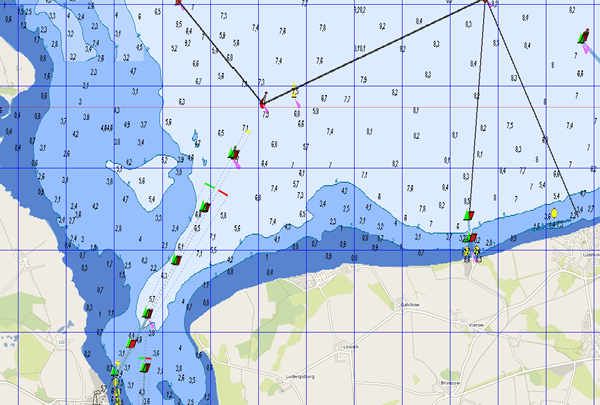

---
  tags:
    - Maps
---
Mobile Atlas Creator Mapsources {: #Mobac}
==========================================

2022/04/17  
Adjustments for Mobac 2.2.2

2021/08/22  
Adjustments for Mobac 2.2x, adaptation to new BSH layers

2020/01/26  
Once again, a few small modifications to the map sources so that access to the BSH servers works again.

Sources
-------

For the [Mobile Atlas Creator](https://mobac.sourceforge.io/), I have created several map sources that allow for more flexible definition of map service access via XML. To use them, unzip the file [avnav-mapsources.zip](../../../downloads/avnav-mapsources.zip) into the "mapsources" directory of the Mobile Atlas Creator.  
For Mobac version 2.2.1, please use the file [avnav-mapsources-before222.zip](../../../downloads/avnav-mapsources-before222.zip).  
For Mobac versions < 2.2.1, please use the file [avnav-mapsources-before22.zip](../../../downloads/avnav-mapsources-before22.zip).  
This will provide you with a "mashUp" of the BSH map services (see also [bsh-viewer](../../bshviewer/bshviewer.md)) and OpenSeaMap ("BSH OpenSeaMap 2021 Extended"). Additionally, it includes BSH alone ("BSH 2021 Extended") or OpenSeaMap + OpenStreetMap ("OWS OpenSeaMap 2021"). If anyone wants to "play around," you can adjust the `.exml` files accordingly.  
The layers for the BSH query are particularly interesting. You can test them with my [bsh-viewer](../../bshviewer/bshviewer.md) (edit the source on the right in each case). You can also adjust the colors if needed – I have tried to create a bit more contrast. If you want to change something, for example, open one of the maps with paint.net, select the hex values for the colors, and enter them in the `.exml` file.

The download usually takes quite a long time – often the BSH server is very slow or tends to crash. In that case, just try again (to do this, set the cache settings in Mobac so that it keeps the maps in the cache for, e.g., 1 month) – eventually, they will all be downloaded. As the format, always choose "OsmdroidGEMF" (which you can also use in other programs, by the way...).

If you make changes to the `.exml` files (especially to the layers), you must delete the corresponding caches under "Tilestore" – otherwise, the changes will not take effect.

Source files on [github](https://github.com/wellenvogel/avnav/tree/master/mobac/testsrc).

The result looks like this, for example (this is the entrance to Greifswald):

Here are the files again:

* [avnav-mapsources.zip](../../../downloads/avnav-mapsources.zip)
  (the map sources BSH, BSH+OpenSeaMap)