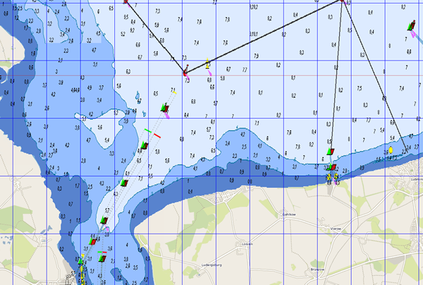

---
  tags:
    - Maps
---
Mobile Atlas Creator Mapsources {: #Mobac}
==========================================

2022/04/17  
Adjustments for mobac 2.2.2

2021/08/22  
Adjustments for mobac 2.2x, adjustment to new BSH layers

2020/01/26  
Once again, a few small modifications to the map sources so that access to the BSH servers works again.

Sources
-------

I have created some map sources for the [Mobile Atlas Creator](https://mobac.sourceforge.io/), which allow for more flexible definition of access to map services via XML. To use them, unzip the file [avnav-mapsources.zip](../../../downloads/avnav-mapsources.zip) into the "mapsources" directory of the Mobile Atlas Creator.  
For Mobac version 2.2.1, please use the file [avnav-mapsources-before222.zip](../../../downloads/avnav-mapsources-before222.zip).  
For Mobac versions < 2.2.1, please use the file [avnav-mapsources-before22.zip](../../../downloads/avnav-mapsources-before22.zip).  
This will provide, among others, a "mashUp" of the BSH map services (see also [bsh-viewer](https://www.wellenvogel.net/software/bshviewer/bshviewer.html)) and OpenSeaMap ("BSH OpenSeaMap 2021 Extended"). Additionally, BSH alone ("BSH 2021 Extended") or OpenSeaMap + OpenStreetMap ("OWS OpenSeaMap 2021") are included. If someone wants to "play around," you can adjust the .exml files accordingly.
The layers for the BSH query are particularly interesting. You can try them out with my [bsh-viewer](https://www.wellenvogel.net/software/bshviewer/bshviewer.html) (edit the source on the right in each case). Furthermore, you can adjust the colors if needed - I have tried to create a bit more contrast. If you want to change something, open one of the maps with, for example, paint.net, select the hex values for the colors, and enter them into the .exml file.

The download usually takes quite a long time - the BSH server is often very slow or prone to crashing. If that happens, simply try again (set the cache settings in Mobac to keep the maps in the cache for, e.g., 1 month) - eventually, they will all be downloaded. Always choose "OsmdroidGEMF" as the format now (you can also use this in other programs...).

If you make changes in the exml files (especially to the layers), you must delete the corresponding caches under Tilestore - otherwise, the changes will not take effect.

Source files on [github](https://github.com/wellenvogel/avnav/tree/master/mobac/testsrc).

The result looks like this, for example (this is the entrance to Greifswald):

Here are the files again:

* [avnav-mapsources.zip](../../../downloads/avnav-mapsources.zip)
  (the mapsources BSH, BSH+OpenSeaMap)