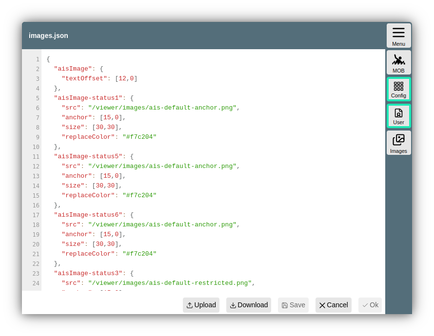

---
  tags:
    - Configuration
    - Icons
---

User Symbols
============

Since version 20201030.

A number of the symbols used in AvNav can be customized to suit your own needs. You can change the size of existing symbols, adjust various properties, or replace them with your own symbols.

If you want to use your own symbols, they must be uploaded as .png files to the images directory - see the [description of user files](userfiles.md).

Which symbols should be changed (and how) is described in a JSON file in the user directory - images.json.

This file has the following structure (example):

```
{
"boatImage": {
"anchor": [20,0],
"size":[40,71]
},  
 "boatImageHdg:{  
 "src": "/user/images/SpecialBoat.png",
"anchor": [15,15],   
 "size":[30,70]  
 }
"markerImage":{
"src": "/user/images/Marker.png",
"anchor": [15,15],
"size":[30,30]
},
"aisNormalImage-Sail":{
"src": "/user/images/Sail-Boat-40.png",
"anchor": [15,15],
"size":[30,30],
"courseVectorColor": "#ff00ff",
"rotate":false
},
"aisNormalImage-Military":{
"anchor": [32,0],
"size":[64,120]
}
}
```

Since 20230614, there is a [base configuration](https://github.com/wellenvogel/avnav/blob/master/viewer/static/images.json) that the system uses. Entries in the user file can override these.

For each symbol to be replaced, an entry with the corresponding name must exist.

General Images
--------------

|  |  |
| --- | --- |
| boatImage | The symbol for the boat on the navigation page |
| boatImageHdg  (20220421) | The symbol for the boat when hdm or hdt are used for display |
| boatImageSteady  (20220421) | The symbol for the boat when zero SOG detect is activated and the boat is not moving |
| markerImage | The symbol for the current target waypoint |
| anchorImage | The symbol for the anchor when the anchor alarm is activated |
| measureImage | The symbol for the starting point of the current measurement |

AIS Images
----------

There are quite a few options for AIS images. Each AIS target can be in a specific state (indicated by a corresponding color)

|  |  |
| --- | --- |
| State | Meaning |
| Normal | AIS target |
| Warning | The closest AIS target that falls below the minimum set CPA |
| Tracking | The AIS target selected via the AIS Info page |
| Nearest | The nearest AIS target |

In addition, AIS images can be distinguished depending on their type (Normal/Aton) and various parameters (ship type, navigation status, aid type).

In principle, it is possible to define a separate icon for each possible combination. However, it is easier (since 20230614) to leave the handling of the state (color) to AvNav. To do this, the icons must contain a color that is then replaced during rendering with the corresponding color of the state. AvNav must be informed of this color via the "replaceColor" parameter (see the [defaults](https://github.com/wellenvogel/avnav/blob/master/viewer/static/images.json) for examples).

This essentially allows the following icon specifications (examples):

|  |  |  |
| --- | --- | --- |
| Key | Meaning |  |
| aisImage | default Ais icon |  |
| aisImage-status1 | Icon for AIS targets with navigational status 1 (At Anchor), for a list of values see the [source code](https://github.com/wellenvogel/avnav/blob/d8fcbdc34841b45581596b790f55be08010cbaa9/viewer/nav/aisformatter.ts#L170). |  |
| aisImage-Fishing | Icon for AIS targets with ship type 30 (Fishing), [see the code](https://github.com/wellenvogel/avnav/blob/d8fcbdc34841b45581596b790f55be08010cbaa9/viewer/nav/aisformatter.ts#L140) for values |  |
| aisImage-Fishing-status1 | Icon for AIS targets with navigational status 1 (At Anchor) and type 30 (Fishing) |  |
| aisatonImage | default AIS Icon for atons |  |
| aisatonImage-type9 | AIS Icon for atons with type 9 (Beacon, Cardinal N), [see the code](https://github.com/wellenvogel/avnav/blob/d8fcbdc34841b45581596b790f55be08010cbaa9/viewer/nav/aisformatter.ts#L264) for values. |  |

Setting images follows a priority:

1. aisImage-Fishing-status1
2. aisImage-Fishing-status\* (since 20250812)
3. aisImage-status1
4. aisImage-Fishing

You therefore have to keep in mind that you may need to make multiple entries if, for example, you want a specific icon for a type (especially before version 20250812) - the defaults already contain entries for status values 1,2,3,4,5,6,7 - so for the Passenger type, for example, you must create entries for:

* aisImage-Passenger-status1
* aisImage-Passenger-status2
* aisImage-Passenger-status3
* aisImage-Passenger-status4
* aisImage-Passenger-status5
* aisImage-Passenger-status6
* aisImage-Passenger-status7

As of version 20250812, the definition also allows a "wildcard" status. 
For the example, you can specify:

* aisImage-Passenger-status\*

If you do not want to work with "replaceColor", you can specify different icons for the states:

aisWarningImage, aisNormalImage, aisWarningImage-status1, ...

Icon Parameters
---------------

The following parameters can be defined for each symbol:

|  |  |  |
| --- | --- | --- |
| src | The URL for the image file. Typically /user/images/XYZ.png for a file uploaded via the download page. If this parameter is not specified, the symbol available in AvNav is used - but you can use the other parameters to change the size, for example. The image files should be a little larger than what you specify for size - e.g., a factor of 2 (but not too large, otherwise performance will suffer). If you have vector graphics, you can use [inkscape](https://inkscape.org), for example, to generate pngs from them. |  |
| size | [width,height] - must be specified as an array (see example). This describes the size of the symbol (the image file is scaled to this size). If you do not specify a src parameter, you can use this to change the size of the internal symbol. |  |
| anchor | [x,y] - the point of the symbol (relative to width and height) that is to be placed at the current position on the map. |  |
| rotate | true or false - if set to false, the symbol is not rotated according to the current heading | not for markerImage |
| courseVector | true or false - if false, no heading vector is drawn for this symbol (even if it is active via settings) | not for markerImage |
| courseVectorColor | the color for the course vector. Here you can choose a color that matches the images used. | not for markerImage |
| replaceColor  (from 20230614) | The color to be replaced depending on the state | only ais...Image |
| textOffset  (from 20230614) | An array [x,y] for the base text offset. In addition, another offset is calculated depending on the course (primarily y). The X value must be based on the size of the icon (size parameter) | only ais...Image |

Parameters that are not specified are replaced by default values. It is also possible to specify only parameters for certain combinations without a custom icon - this allows you to make AIS symbols different sizes, for example. Typically, changing size also requires changing anchor.

When editing images.json, make sure to produce valid json. Within AvNav, the file can be edited under [User Files](userfiles.md).



After modifying images.json, AvNav must be reloaded - e.g. via {{BT("MainNav")}}-> Actions ->{{BT("ReloadUI")}}.