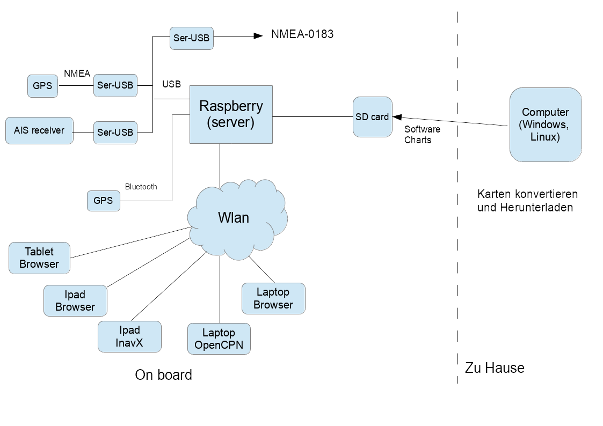

Einführung
==========

.. toctree::
   :hidden:
   

   setups

Motivation
----------

Nachdem ich schon eine ganze Weile mit Rasterkarten unterwegs navigiere 
(erst unter Windows mit Seaclear, dann unter Windows, WindowsCE und 
OSX mit OpenCPN und OziExplorer) hatte ich schon länger nach Möglichkeiten 
gesucht, das zu erweitern und noch besser tauglich für unterwegs zu machen.

Meine Wunschliste dabei war:

*  Navigation auf kleinen Geräten (Laptop ist immer ein wenig unhandlich)
   – 7 oder 10 Zoll Tablet wäre Ideal
*  Navigation auch im Cockpit
*  Trackaufzeichnung
*  Verknüpfung mit der „on board“ Navigation 
   (seit einiger Zeit habe ich ein RO6800 als Funke, 
   das auch einen AIS Decoder hat – 
   und ja auch schon GPS Daten bekommt)
*  Nutzung der Rasterkarten (BSB, NV, alles was sich per Download über mobile atlas creator bekommen lässt...)
*  Minimaler Installationsaufwand
*  Klein, wenig Stromverbrauch (sollte möglichst immer laufen können)
*  Wenig „Bastelarbeit“ - also möglichst keine eigenen Schaltungen löten
*  Irgendwann habe ich mal den raspberry pi entdeckt und nachdem er zu Hause jetzt schon eine Weile als media center arbeitet, dachte ich, dass der eine gute Basis für einen Bordcomputer abgeben könnte.
*  Allerdings musste ich nach einiger Recherche feststellen, dass es noch keine fertige Software gab, die meinen Anforderungen genügen würde. Insbesondere die Einbettung der seriellen Schnittstellen (typisch seriell-usb-Wandler) macht immer wieder Mühe, da Linux hier immer etwas kreativ ist...
*  Also habe ich beschlossen mich selbst daran zu machen. Im Folgenden will ich meine Lösung beschreiben, da es ja vielleicht Interessierte gibt, die es Nachnutzen möchten. Die gesamte Software steht zum download unter einer open source Lizenz bereit.

Mittlerweile (2019) ist die Software schon über 6 Jahre alt, 
hat sich weiter entwickelt und neue Dinge dazugelernt.

Neben der Nutzung auf dem Raspberry gibt es eine eigenständige Android-App,
einen Windows Installer und Pakete, die sich auf Debian Linux installieren lassen.

Struktur
---------

Das Bild zeigt den grundsätzlichen Einsatz von AvNav.

Auf dem raspberry läuft eine Server-Software 
(installiert über Pakete  oder ein fertiges Image), die die angeschlossenen Geräte
(NMEA über Seriell-USB Wandler – z.B. PL 2303), Bluetooth GPS,... abfragt, 
die Daten aufbereitet und per WLAN zur Verfügung stellt.

Auf einem PC (typisch sicher eher zu Hause) mit Windows oder Linux kann die AvNav Software ebenfalls 
installiert werden, um hier die Karten in das von AvNav benötigte Format zu konvertieren - oder die Karten mittels
`Mobile Atlas Creator <https://mobac.sourceforge.io/>`_ herunterzuladen.

Der Raspberry stellt die Daten auf verschiedene Art bereit:

*  per NMEA-0183 - er arbeitet damit als NMEA Multiplexer
*  per TCP über WLAN - damit kann er auf anderen Geräten (oder auch auf dem Raspberry) installierte
   Navigationssoftware mit allen empfangenen NMEA Daten versorgen.
*  Über eine Web-App (d.h. Webseiten im Browser). Diese können auf beliebigen Geräten im WLAN
   dargestellt werden - auf dem Gerät muss nur ein Browser installiert sein. In dieser App erfolgt auch
   die Kartendarstellung.

Neben den Daten über NMEA-0183 kann die Raspberry Software auch Daten über TCP oder UDP empfangen.
Über enstprechende Adapter können auch NMEA-2000 Daten eingespeist werden.

Die Server-Software ist in python geschrieben und kann damit problemlos auf verschiedenen Systemen laufen.
Es gibt fertige Pakete, die direkt auf dem Raspberry oder auf Linux Systemen installiert werden können.
Für Windows gibt es einen Installer.

Daneben gibt es für den Raspberry auch fertige Images für die SD-Karte zum Download.

Die Web Applikation bietet eine  Navigation mit Rasterkarten inklusive AIS Darstellung, 
Wegepunkt Navigation und Routing. Falls die Web-Applikation verwendet werden soll, 
müssen die Karten dafür auch auf dem raspberry installiert werden. 
Diese müssen dazu vorher auf dem PC (Windows, Osx, Linux) in das gemf Format konvertiert werden
(ab 2015-10-19 kann das auch direkt auf dem Raspberry erfolgen - das dauert aber länger...).

Im Wesentlichen können die folgenden Kartenquellen verarbeitet werden:

*  Alle Kartentypen, die die GDAL software lesen kann (also insbesondere BSB Karten)
*  Mit Mobile Atlas Creator heruntergeladene Karten
*  Zur Nutzung von NV digital Karten bitte ich um Kontaktaufnahme, hier ist die Einhaltung der Lizenzbedingungen ein Thema.

Neben dem oben beschriebenen Einsatz gibt es auch noch eine Android-App, die die Funktionen der WebApp
enhält und die ohne weiteres Zubehör auf einem Android Gerät laufen kann. Diese kann ihre Daten
über das eingebaute GPS, Bluetooth, USB oder IP bekommen.

