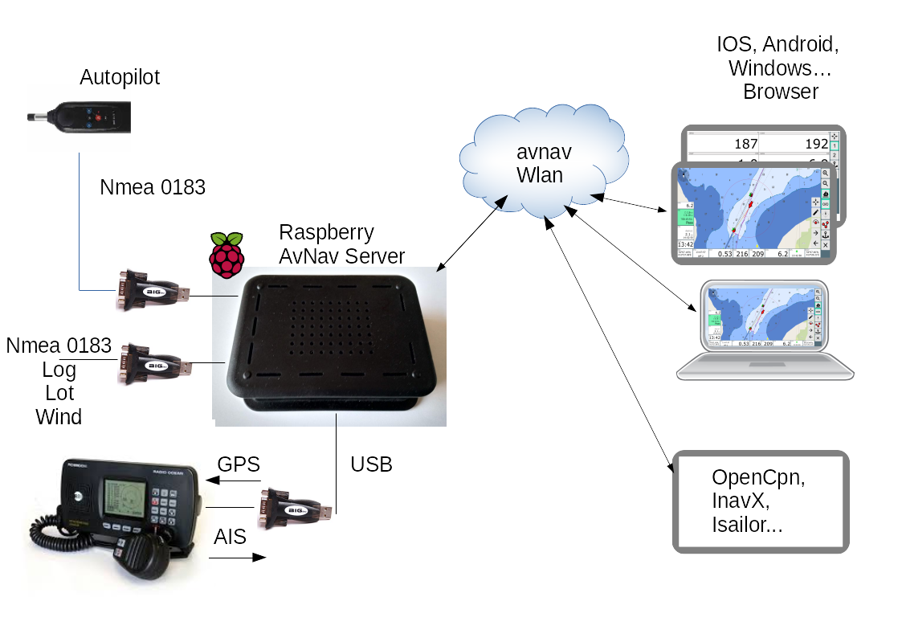
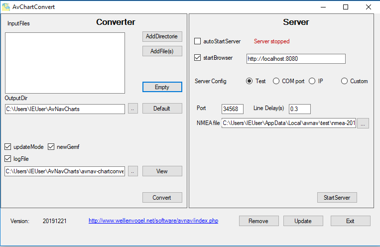

Varianten
---------------

.. index:: RaspberryServer

Raspberry Pi
~~~~~~~~~~~~

   Raspberry Setup

Ein Raspberry Pi arbeitet als Server (normalerweise ohne Bildschirm und Tastatur
- aber es gibt auch eine avnav-touch Variante, die direkt einen angeschlossenen Bildschirm hat).
An den raspberry werden über Seriell-USB Wandler NMEA0183 Geräte angeschlossen.
Über einen entsprechenden Gateway ist auch NMEA 2000 möglich.

Normalerweise muss dazu nichts konfiguriert werden, die Software erkennt per USB angeschlossene
Geräte von selbst und versucht die korrekte Baudrate einzustellen.

Im Raspberry ist auch ein NMEA Multiplexer integriert, so dass einkommende Daten
auch beliebig an Anschlüssen wieder ausgegeben werden können (z.B. ein Funkgerät,
das AIS Daten bereitstellt benötigt auch die GPS Information).

Der Raspberry erzeugt ein WLAN und andere Geräte können sich mit diesem verbinden.
Auf diesen anderen Geräten muss nur ein Browser verfügbar sein, um die AvNav Web Applikation
darstellen zu können.

Damit die Geräte den Raspberry leichter finden können, macht sich avnav mittels 
`Bonjour <https://de.wikipedia.org/wiki/Bonjour_(Apple)>`_ bekannt.
Wenn man eine entsprechende App installiert hat (`Android <https://play.google.com/store/apps/details?id=de.wellenvogel.bonjourbrowser&hl=gsw>`_,
`IOS <https://apps.apple.com/us/app/bonjour-search-for-http-web-in-wi-fi/id1097517829?app=itunes&ign-mpt=uo%3D4>`_),
kann man ganz ohne Adresseingabe avnav kontaktieren. Sonst kann man die Adresse 
avnav.avnav.de nutzen.

Neben der Nutzung über die AvNav WebApp kann man AvNav auch einfach als NMEA Multiplexer 
und Wlan Gateway nutzen. Die Daten werden dann über WLAN per TCP oder UDP für
andere Navigationssoftware bereitgestellt.

Android
~~~~~~~

Für Android gibt es 2 Varianten:

* Die "normale" App - hier läuft AvNav auf einem Android Gerät. Die Karten sind dort installiert.
  NMEA Daten können vom internen GPS kommen oder per USB(-OTG), Bluetooth, Wlan.
* Die Master-Slave Variante. Hier ist ein Android Gerät der Master (Server), weitere Geräte
  können sich über WLAN verbinden.

.. figure:: ../_static/images/AndroidMasterSlave.png
   :class: img-default

   Android Master Slave

In dieser Variante läuft AvNav auf einem Android Gerät im sogenannten "External Browser" mode.
Das könnte z.B. auch ein `Android Autoradio <https://www.segeln-forum.de/board194-boot-technik/board35-elektrik-und-elektronik/73496-plotter-diy/#post2077437>`_ sein.

Windows
~~~~~~~

Für Windows gibt es ebenfalls eine Variante. Hier liegt der Schwerpunkt etwas 
mehr auf dem Konvertieren von Karten für AvNav, es stehen aber genauso alle 
Navigationsfunktionen zur Verfügung.

   Windows
