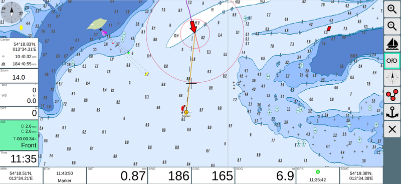

.. _page-navpage:

Navigation
~~~~~~~~~~
Nach der Auswahl einer Karte gelangt man auf die Navigationsseite.

.. image:: ../_static/images/navi-no-route.png
   :class: img-default

Im Bild ist kein Routing aktiv, die Karte ist "North up" und 
die Karte wird auch nicht mit dem Boot verschoben.
Links und unten sind verschiedene Anzeigen vorhanden, diese können
über das "Layout" TODO konfiguriert werden.

.. |icboat| externalimage:: Boat2.png
                     :class: img-inline
.. |btcup| externalimage:: icons-new/compass.svg
                     :class: img-inline  
.. |btlock| externalimage:: icons-new/boat.svg                                        
            :class: img-inline
.. |btnav| externalimage:: icons-new/waypoint.svg
           :class: img-inline
.. |btstop| externalimage:: icons-new/stop-nav.svg
           :class: img-inline
.. |btroute| externalimage:: icons-new/route.svg
           :class: img-inline                         

Das Boot wird über das Icon |icboat| dargestellt.

Mit dem Button |btlock| wird der Mittelpunkt der Karte auf die
aktuelle Bootsposition gesetzt und die Karte mit der Bewegung
des Bootes verschoben.

.. image:: ../_static/images/navi-locked.png
   :class: img-default

.. index:: Wegepunkt
.. index:: Navigation

Wegepunkt-Navigation
--------------------

Die einfachste Routing Funktion ist das Navigieren zu einem Wegepunkt.
Dazu verschiebt man den Mittelpunkt der Karte auf den gewünschten
Zielpunkt (dazu muss |btlock| inaktiv sein).
Dann startet man die Navigation mit dem Button |btnav|.
Links unten (im Standard Layout) werden jetzt die Daten zum aktuellen Wegepunkt angezeigt.
Auf der Karte werden die Kurslinie und die Ziellinie zum aktuellen Wegepunkt 
dargestellt.

Mit dem Button |btstop| wird die Wegepunkt Navigation beendet.

Routen-Navigation
------------------

Mit dem Button |btroute| beginnt man das Erstellen einer Route.

