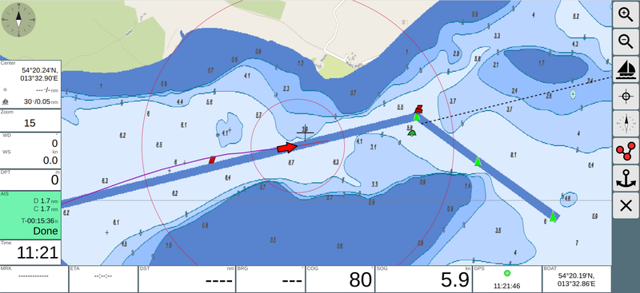
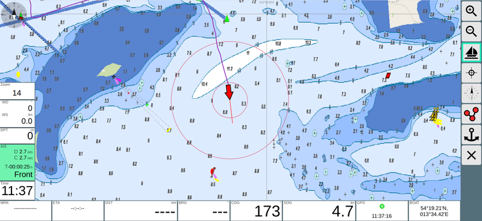

Navigation
~~~~~~~~~~
Nach der Auswahl einer Karte gelangt man auf die Navigationsseite.

Im Bild ist kein Routing aktiv, die Karte ist "North up" und 
die Karte wird auch nicht mit dem Boot verschoben.
Links und unten sind verschiedene Anzeigen vorhanden, diese können
über das "Layout" TODO konfiguriert werden.

.. |icboat| externalimage:: Boat2.png
                     :class: img-inline
.. |btcup| externalimage:: icons-new/compass.svg
                     :class: img-inline  
.. |btlock| externalimage:: icons-new/boat.svg                                        
            :class: img-inline  

Das Boot wird über das Icon |icboat| dargestellt.

Mit dem Button |btlock| wird der Mittelpunkt der Karte auf die
aktuelle Bootsposition gesetzt und die Karte mit der Bewegung
des Bootes verschoben.

Die einfachste Routing Funktion ist    

