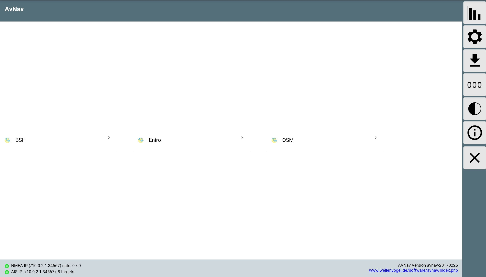

Start
~~~~~

Zum Start der Applikation kann man im AvNav WLAN normalerweise einfach die Adresse::

  http://avnav.avnav.de

eingeben.
Für mobile Geräte empfiehlt sich die Installation einer App, die Server per Bonjour abfragen kann 
- z.b. `Bonjour Browser <https://play.google.com/store/apps/details?id=de.wellenvogel.bonjourbrowser&hl=de>`_ für Android
und `Bonjour Search <https://apps.apple.com/us/app/bonjour-search-for-http-web-in-wi-fi/id1097517829>`_ für IOS.
AvNav macht seine Serveradresse über diesen Weg bekannt.

Nach dem Start sieht man zuächst die Einstiegsseite.

.. |btdl| externalimage:: icons-new/ic_file_download.svg
                 :class: img-inline

Hier kann die Karte ausgewählt werden, die zur Navigation genutzt werden soll.
Wenn keine Karten vorhanden sind, wird u.U. eine Fehlermeldung ausgegeben.
Karten können dann über die Download-Seite (Button |btdl|) hochgeladen werden.

Durch Auswahl einer Karte gelang man auf die Navigationsseite.

Die weiteren Funktionen

.. |btstatus| externalimage:: icons-new/status.svg
                     :class: img-inline
.. |btset| externalimage:: icons-new/ic_settings.svg
                     :class: img-inline                     
.. |btdash| externalimage:: icons-new/data.svg
                     :class: img-inline
.. |btnight| externalimage:: icons-new/night.svg
                     :class: img-inline
.. |btinfo| externalimage:: icons-new/ic_info.svg
            :class: img-inline                              

============  ============================================================
Button        Funktion
============  ============================================================
|btstatus|    Aufruf der Statusseite
|btset|       Aufruf der Einstellungsseite
|btdl|        Download / Upload (Karten, Tracks, Routen, Layouts)
|btdash|      "Dashboard" - Anzeige von wichtigen Werten (auch ohne Karte)
|btnight|     Nachtmodus
|btinfo|      Aufruf der Lizenz- und Datenschutzseite
============  ============================================================

